# Phase 3：核心资���
> 预计用时�~5 天（建议�**Part A 2~3 �+ Part B 2~3 �*� 
> 目标：��腾讯云核心资��Terraform 编�，能�建完整网络��

### 本章结�

```
Part A（网�+ 计算�        Part B（数�库 + 存储 + 负载�衡�├── 3.1 VPC 网络体系          ├── 3.3 数�库（MySQL + Redis�├── 3.2 计算资�（CVM + AS� ├── 3.4 存储（COS + CBS�                              ├── 3.5 负载�衡 CLB
                              ├── 3.6 安全�                              ├── 3.7 其他常用资�
                              └── 3.8 资��赖�生命周�```

> 📖 **学习建议**：��一天学完�先学 Part A 并动手�践，第二天��Part B。�个资�类�都动手创建一��能记��>
> 💰 **费用�醒**：本章会创建 CVM�MySQL�Redis�CLB 等多个资�，��时总费用约 **3~8 �*�> 学习时请�Part A �`destroy` �Part B 的顺�，��一次性创建所有资��
> 建议在腾讯云�制��费用中心 �预算管�设置 **100 元预算告�*�
---

## 3.1 VPC 网络体系

### 网络��示例

```
Internet
    �    �┌──────────�    ┌───────────�� CLB     �    � NAT网关  ��(公网)   �    �(公网)    �└────┬─────�    └─────┬─────�     �                �     �                �┌─────────────────────────────────��          VPC (10.0.0.0/16)     �� ┌──────────────────────�      �� �公网�网 (10.0.1.0/24)�      �� � CVM (带公�         �      �� └──────────────────────�      �� ┌──────────────────────�      �� �内网�网 (10.0.2.0/24)�      �� � CVM (无公�         �      �� � MySQL / Redis        �      �� └──────────────────────�      �└─────────────────────────────────�```

### 为什么这样设计？

- **公网�网**：放置需�公网访问的 Web �务器，通过 CLB 或直�绑 EIP 对外�供�务
- **内网�网**：放置数�库�缓存等�端�务，没有公�IP，�能通过 NAT 网关访问互�网（用�更新软件包等�- **NAT 网关**：让内网�网的�务器能访问互�网，但互�网�能主动访问它�- **路由表分�*：公网�网的路由指� EIP 或互�网网关，内网�网的路由指� NAT 网关

### 完整 VPC 代�

```hcl
# VPC
resource "tencentcloud_vpc" "main" {
  name       = "prod-vpc"
  cidr_block = "10.0.0.0/16"

  tags = {
    Name        = "prod-vpc"
    Environment = "production"
  }
}

# 公网�网
resource "tencentcloud_subnet" "public" {
  name              = "public-subnet"
  vpc_id            = tencentcloud_vpc.main.id
  cidr_block        = "10.0.1.0/24"
  availability_zone = "ap-guangzhou-3"
  is_multicast      = false
}

# 内网�网
resource "tencentcloud_subnet" "private" {
  name              = "private-subnet"
  vpc_id            = tencentcloud_vpc.main.id
  cidr_block        = "10.0.2.0/24"
  availability_zone = "ap-guangzhou-3"
  is_multicast      = false
}

# 路由�resource "tencentcloud_route_table" "public" {
  name   = "public-rt"
  vpc_id = tencentcloud_vpc.main.id
}

resource "tencentcloud_route_table" "private" {
  name   = "private-rt"
  vpc_id = tencentcloud_vpc.main.id
}

# 路由表关���resource "tencentcloud_route_table_association" "public" {
  route_table_id = tencentcloud_route_table.public.id
  subnet_id      = tencentcloud_subnet.public.id
}

resource "tencentcloud_route_table_association" "private" {
  route_table_id = tencentcloud_route_table.private.id
  subnet_id      = tencentcloud_subnet.private.id
}

# 创建 EIP（弹性公�IP�resource "tencentcloud_eip" "nat" {
  name = "nat-eip"
}

# NAT 网关（内网�网访问互�网�resource "tencentcloud_nat_gateway" "main" {
  name              = "prod-nat"
  vpc_id            = tencentcloud_vpc.main.id
  max_concurrent    = 1000000
  bandwidth         = 500
  assigned_eip_set  = [tencentcloud_eip.nat.public_ip]  # 注�：这里传入的�EIP �IP 地�，��ID
}

# NAT 路由（内网���NAT 网关 �互�网）
resource "tencentcloud_route_entry" "nat" {
  route_table_id         = tencentcloud_route_table.private.id
  destination_cidr_block = "0.0.0.0/0"
  next_type              = "NAT"
  next_hub               = tencentcloud_nat_gateway.main.id
}

# 公网�网默认路由
resource "tencentcloud_route_entry" "internet" {
  route_table_id         = tencentcloud_route_table.public.id
  destination_cidr_block = "0.0.0.0/0"
  next_type              = "INTERNET_GATEWAY"  # 公网�网通过 Internet Gateway 访问互��}
```

### 常�陷阱

| 陷阱 | 说� |
|------|------|
| **CIDR ��** | 如�将�需�� VPC 对等��，两�VPC �CIDR 段�能��|
| **�网 CIDR 预留** | 建议预留至少 1/3 �VPC 地�空间给未�扩�|
| **NAT 网关带宽** | 生产�境 NAT 网关带宽建议���200Mbps |
| **路由表数���* | 腾讯云��VPC 最�10 个路由表，需���规�|

---

> 💡 **网络�好了�** �在 VPC��网�路由表�NAT 网关都已�就绪。�下�我们�*计算资�**（CVM �务器）放进��
---

## 3.2 计算资�

### 3.2.1 CVM �例

```hcl
# 查询镜�（Data Source�data "tencentcloud_images" "default" {
  image_type = ["PUBLIC_IMAGE"]
  os_name    = "TencentOS Server 3.2"
}

# 查询�例类�
data "tencentcloud_instance_types" "default" {
  cpu_core_count = 2
  memory_size    = 4
}

# 创建密钥对（��替代密�登录�resource "tencentcloud_key_pair" "main" {
  key_name   = "prod-key"
  public_key = file("~/.ssh/id_rsa.pub")  # �本地文件读�公�}

# 创建 CVM
resource "tencentcloud_cvm_instance" "web" {
  instance_name     = "web-server-${count.index + 1}"
  availability_zone = "ap-guangzhou-3"
  image_id          = data.tencentcloud_images.default.images[0].image_id
  instance_type     = data.tencentcloud_instance_types.default.instance_types[0].instance_type

  system_disk_type = "CLOUD_SSD"
  system_disk_size = 50

  data_disks {
    data_disk_type = "CLOUD_SSD"
    data_disk_size = 100
  }

  vpc_id    = tencentcloud_vpc.main.id
  subnet_id = tencentcloud_subnet.public.id

  security_groups = [tencentcloud_security_group.web.id]

  internet_max_bandwidth_out = 10
  allocate_public_ip         = true

  # 密钥对（��替代密��  key_ids = [tencentcloud_key_pair.main.id]

  # 自定义数�（�始化脚本）
  user_data = <<-EOF
    #!/bin/bash
    yum install -y nginx
    systemctl enable nginx
    systemctl start nginx
  EOF

  tags = {
    Name = "web-server-${count.index + 1}"
  }

  count = var.instance_count
}

# 密钥对说�```

> 💡 **CVM 创建注�事项�*
> - `key_ids` �`password` 二选一，��使用密钥对
> - `user_data` 仅在首次�动时执行，���会�次执行
> - `security_groups` 传入的是一个安全组 ID 列表
> - `allocate_public_ip = true` �会分�公网 IP

### 3.2.2 弹性伸�(Auto Scaling)

弹性伸�AS（Auto Scaling）根�业务负载自动调�CVM �例数�，是生产�境高�用的关键组件�
```hcl
# �动�置
resource "tencentcloud_as_scaling_config" "launch" {
  configuration_name = "web-launch-config"
  image_id           = data.tencentcloud_images.default.images[0].image_id
  instance_types     = ["S5.LARGE8"]

  system_disk_type = "CLOUD_SSD"
  system_disk_size = 50

  internet_charge_type       = "TRAFFIC_POSTPAID_BY_HOUR"
  internet_max_bandwidth_out = 10
  public_ip_assigned         = true

  key_ids = [tencentcloud_key_pair.main.id]

  security_group_ids = [tencentcloud_security_group.web.id]

  user_data = <<-EOF
    #!/bin/bash
    echo "Starting web server..." > /var/log/startup.log
  EOF
}

# 伸缩�resource "tencentcloud_as_scaling_group" "web" {
  scaling_group_name   = "web-asg"
  scaling_config_id    = tencentcloud_as_scaling_config.launch.id
  vpc_id               = tencentcloud_vpc.main.id
  subnet_ids           = [tencentcloud_subnet.public.id]
  project_id           = 0
  max_size             = 5
  min_size             = 1
  desired_size         = 2
  removal_policy       = "REMOVE_OLDEST_INSTANCE"
  default_cooldown     = 300

  # 关� CLB
  load_balancer_ids = [tencentcloud_clb_instance.main.id]
}

# 伸缩策略（CPU 超过 70% 扩容 ��加 1 ��例）
resource "tencentcloud_as_scaling_policy" "scale_up" {
  scaling_group_id    = tencentcloud_as_scaling_group.web.id
  policy_name         = "cpu-scale-up"
  adjustment_type     = "CHANGE_IN_CAPACITY"   # 调整容�，而�设置为精确�  adjustment_value    = 1                       # �加 1 ���  cooldown            = 300

  metric {
    metric_name          = "CPU_UTILIZATION"
    statistic            = "AVERAGE"
    threshold            = 70
    comparison_operator  = "GREATER_THAN"
    period               = 60
    continuous_time      = 5
  }
}

# 伸缩策略（CPU �� 30% 缩容 ��少 1 ��例）
resource "tencentcloud_as_scaling_policy" "scale_down" {
  scaling_group_id    = tencentcloud_as_scaling_group.web.id
  policy_name         = "cpu-scale-down"
  adjustment_type     = "CHANGE_IN_CAPACITY"   # 调整容�
  adjustment_value    = -1                      # �少 1 ���  cooldown            = 300

  metric {
    metric_name          = "CPU_UTILIZATION"
    statistic            = "AVERAGE"
    threshold            = 30
    comparison_operator  = "LESS_THAN"
    period               = 60
    continuous_time      = 5
  }
}
```

> ⚠� **关� `adjustment_type` 的说�：**
> - `CHANGE_IN_CAPACITY`：�加或�少指定数�的�例（调整值�正�负）
> - `EXACT_CAPACITY`：将�例数设置为精确值（调整值必须为正整数）
> - `PERCENT_CHANGE_IN_CAPACITY`：按百分比调�> 
> 扩容应该�`CHANGE_IN_CAPACITY` + 正数，缩容用 `CHANGE_IN_CAPACITY` + 负数�
---

> �� **Part A 结�，建议休�一下�**
>
> 你已�学完了 **网络（VPC/�网/路由�* �**计算（CVM/AS�* 两大��> 建议先动手�践，�继续往下学�>
> **动手�践�*
> 1. 用你学到�VPC + CVM 代�创建一套基础�境
> 2. �SSH 登录 CVM 看看
> 3. 执行 `terraform destroy` 清�
>
> 以下开�**Part B：数�库 + 存储 + 负载�衡**

---

## 3.3 数��
### 3.3.1 TencentDB for MySQL

> 💰 **费用�醒**：MySQL 4C8G 200GB 按�计费�**1.5~2 ��时**，一天约 40 元�> 如��是学习，建议创建� 1 �时内验�完毕并 `destroy`，��高�账��

```hcl
# 创建安全组和安全组规则（�3.6 节）
# 此处�设已创�tencentcloud_security_group.mysql

# 创建 MySQL �例
resource "tencentcloud_mysql_instance" "main" {
  instance_name  = "prod-mysql"
  mem_size       = 4000    # 4GB
  cpu_core_count = 4
  volume_size    = 200     # 200GB

  engine_version    = "8.0"
  charge_type       = "POSTPAID"
  device_type       = "UNIVERSAL"  # 通用�  availability_zone = "ap-guangzhou-3"

  vpc_id    = tencentcloud_vpc.main.id
  subnet_id = tencentcloud_subnet.private.id

  # 安全�  security_groups = [tencentcloud_security_group.mysql.id]

  # 自动续费
  auto_renew_flag = 1
  force_delete    = true    # �许 terraform destroy 时强制删�
  parameters = {
    character_set_server = "utf8mb4"
    max_connections      = "1000"
  }

  tags = {
    Name        = "prod-mysql"
    Environment = "production"
  }
}

# MySQL �读�例
resource "tencentcloud_mysql_readonly_instance" "readonly" {
  instance_name      = "prod-mysql-ro"
  master_instance_id = tencentcloud_mysql_instance.main.id
  mem_size           = 4000
  volume_size        = 200
  device_type        = "UNIVERSAL"
  zone               = "ap-guangzhou-4"  # 跨�用区部署
  vpc_id             = tencentcloud_vpc.main.id
  subnet_id          = tencentcloud_subnet.private.id

  security_groups = [tencentcloud_security_group.mysql.id]
}

# 数�库账�resource "tencentcloud_mysql_account" "app" {
  mysql_id = tencentcloud_mysql_instance.main.id
  name     = "app_user"
  password = var.mysql_password
  host     = "%"    # % 表示�许任� IP ��
}

# 创建数��resource "tencentcloud_mysql_database" "app" {
  mysql_id      = tencentcloud_mysql_instance.main.id
  db_name       = "app_database"
  character_set = "utf8mb4"
}

# 账���
resource "tencentcloud_mysql_privilege" "app" {
  mysql_id       = tencentcloud_mysql_instance.main.id
  account_name   = tencentcloud_mysql_account.app.name
  account_host   = tencentcloud_mysql_account.app.host
  global         = ["SELECT", "INSERT", "UPDATE", "DELETE", "CREATE", "ALTER"]
  database       = tencentcloud_mysql_database.app.db_name
  database_privileges = ["SELECT", "INSERT", "UPDATE", "DELETE", "CREATE", "ALTER"]
}
```

> 💡 **MySQL 设计�点�*
> - 主库和�读�例部署在���用区，��跨�用区高��> - 数�库部署在**内网�网**，�暴露公网
> - `force_delete = true` �许 Terraform 删除 MySQL �例（生产�境�用��> - `character_set_server = "utf8mb4"` 支�完整�Unicode，包�emoji

### 3.3.2 TencentDB for Redis

> 💰 **费用�醒**：Redis 4GB 标准版按�计费约 **0.5~0.8 ��时**，一天约 15 元�
```hcl
resource "tencentcloud_redis_instance" "main" {
  type_id           = 6               # 6=标准版，7=集群版（type �数已弃用）
  name              = "prod-redis"
  zone              = "ap-guangzhou-3"
  mem_size          = 4096           # 4GB
  charge_type       = "POSTPAID"
  port              = 6379
  vpc_id            = tencentcloud_vpc.main.id
  subnet_id         = tencentcloud_subnet.private.id
  security_groups   = [tencentcloud_security_group.redis.id]
  password          = var.redis_password

  # 自动续费
  auto_renew_flag   = 1
  no_auth           = false   # 需�密�认�
  tags = {
    Name        = "prod-redis"
    Environment = "production"
  }
}
```

> ⚠� **Redis 注�点：**
> - `type_id = 6` 是标准版（主���），`type_id = 7` 是集群版（`type` �数已弃用，请使�`type_id`�> - Redis 密��求：长�8-64 �，至少包�大写字���写字��数字和特殊字符中的三�
> - `no_auth = false` 表示需�密�认�，生产�境必须开�
---

> 💡 **数�库就绪�** MySQL 存结�化数�，Redis �缓存加速。�下�我们�*��文�*（图片�视频�备份）存到对象存储里�
---

## 3.4 存储

### 3.4.1 对象存储 COS

```hcl
# COS Bucket
resource "tencentcloud_cos_bucket" "static" {
  bucket = "prod-static-${var.app_id}"  # 全局唯一，�能和其他用户��
  acl    = "private"

  # 版本�制
  versioning_enable = true

  # �务端加�  encryption_algorithm = "AES256"

  # 生命周期规则
  lifecycle_rule {
    id      = "logs"
    enabled = true
    prefix  = "logs/"

    expiration {
      days = 90
    }
  }

  tags = {
    Name        = "prod-static"
    Environment = "production"
  }
}

# COS 对象上传
resource "tencentcloud_cos_bucket_object" "index" {
  bucket = tencentcloud_cos_bucket.static.bucket
  key    = "index.html"
  source = "../static/index.html"
  etag   = filemd5("../static/index.html")
}
```

> 💡 **COS 设计�点�*
> - Bucket �称**全局唯一**，建议使�`项目-�境-appid` 的命�格�> - `versioning_enable = true` 开�版本�制，防止误删文件
> - 生命周期规则自动清�过期日志，节�存储��> - `acl = "private"` 表示�有读写，�对外公开

### 3.4.2 云硬�CBS

```hcl
# 创建云硬�resource "tencentcloud_cbs_storage" "data" {
  storage_name      = "data-disk"
  storage_type      = "CLOUD_SSD"
  storage_size      = 200
  availability_zone = "ap-guangzhou-3"
  project_id        = 0
  charge_type       = "POSTPAID"

  tags = {
    Name = "data-disk"
  }
}

# 挂载�CVM
resource "tencentcloud_cbs_storage_attachment" "data" {
  storage_id  = tencentcloud_cbs_storage.data.id
  instance_id = tencentcloud_cvm_instance.web[0].id
}

# 定期快照策略
resource "tencentcloud_cbs_snapshot_policy" "daily" {
  snapshot_policy_name = "daily-snapshot"
  repeat_hours         = [2]           # �天凌晨2�  repeat_weekdays      = [1, 2, 3, 4, 5, 6, 7]
  retention_days       = 30
}

# 关�快照策略到云硬盘
resource "tencentcloud_cbs_snapshot_policy_attachment" "daily" {
  storage_id         = tencentcloud_cbs_storage.data.id
  snapshot_policy_id = tencentcloud_cbs_snapshot_policy.daily.id
}
```

> ⚠� **CBS 注��* 挂载�CVM �，还需�在�作系统�*手动格�化并挂载**文件系统，Terraform �会自动完�这一步�
---

> 💡 **存储就绪�* �在我们�COS（对象存储）放��文件，CBS（云硬盘）挂载到 CVM �数�盘。最�一步，我们加一�*负载�衡�*，把用户��分�到多�CVM 上�
---

## 3.5 负载�衡 CLB

### CLB 的层级关�
�解 CLB 的层级关系�常��：

```
CLB �例（tencentcloud_clb_instance�  └── 监�器（tencentcloud_clb_listener��监�端�和��        └── 转�规则（tencentcloud_clb_listener_rule）�HTTP/HTTPS 的域�和路径规则
              └── �端目标（tencentcloud_clb_attachment）��际处�请求�CVM
```

- **Layer 4 �议（TCP/UDP�*：监�器直�绑定�端目标，�需�转�规�- **Layer 7 �议（HTTP/HTTPS�*：监�器通过转�规则（域�路径）分�请求到�端目标

### 完整 CLB �置

> 💰 **费用�醒**：公�CLB 按�计费�**0.2 ��时**，一天约 5 元�
```hcl
# 公网 CLB �例
resource "tencentcloud_clb_instance" "main" {
  clb_name             = "prod-web-clb"
  network_type         = "OPEN"          # 公网类�（INTERNAL 为内网类�）
  vpc_id               = tencentcloud_vpc.main.id
  subnet_id            = tencentcloud_subnet.public.id
  project_id           = 0
  internet_charge_type = "TRAFFIC_POSTPAID_BY_HOUR"

  tags = {
    Name = "prod-web-clb"
  }
}

# CLB 监�器（HTTP:80�# 注�：HTTP/HTTPS 监�器�需�http_forward �数，转�由 listener_rule �制
resource "tencentcloud_clb_listener" "http" {
  clb_id        = tencentcloud_clb_instance.main.id
  listener_name = "http"
  port          = 80
  protocol      = "HTTP"
}

# CLB 监�器（HTTPS:443�resource "tencentcloud_clb_listener" "https" {
  clb_id              = tencentcloud_clb_instance.main.id
  listener_name       = "https"
  port                = 443
  protocol            = "HTTPS"
  certificate_id      = var.ssl_certificate_id
  certificate_ssl_mode = "UNIDIRECTIONAL"  # ��认�（MUTUAL ��认�需�外�置 CA �书�}

# 监�器转�规则（�HTTP/HTTPS 监�器需�）
resource "tencentcloud_clb_listener_rule" "api" {
  clb_id              = tencentcloud_clb_instance.main.id
  listener_id         = tencentcloud_clb_listener.http.listener_id
  domain              = "api.example.com"
  url                 = "/"
  health_check_switch = true
  health_check_http_code = 200
}

# �端目标绑定（将 CVM 注册�CLB 监�器）
# 注�：如�是 TCP/UDP 监�器，直�绑定�listener；如�是 HTTP/HTTPS，绑定到 rule
resource "tencentcloud_clb_attachment" "web" {
  clb_id      = tencentcloud_clb_instance.main.id
  listener_id = tencentcloud_clb_listener.http.listener_id
  rule_id     = tencentcloud_clb_listener_rule.api.rule_id  # HTTP/HTTPS listener 需�指�rule_id

  targets {
    instance_id = tencentcloud_cvm_instance.web[0].id
    port        = 80
    weight      = 10
  }
  targets {
    instance_id = tencentcloud_cvm_instance.web[1].id
    port        = 80
    weight      = 10
  }
}
```

> ⚠� **CLB 常�陷阱�*
> - `http_forward` �是 CLB 监�器的�数，HTTP 转�是通过 `tencentcloud_clb_listener_rule` ���> - HTTP/HTTPS 监�器绑定�端目标时必须指定 `rule_id`
> - TCP/UDP 监�器绑定�端目标时�需�`rule_id`
> - CLB 创建�需�等�1-2 分钟�能完全生效
> - 公网 CLB �`subnet_id` 是必填的

---

## 3.6 安全�
### 安全组设计��
安全组是腾讯云的网络访问�制层，�循以下�则�
1. **最�����*：�开放必�的端�
2. **安全组引�*：数�库安全组引�Web 安全组，而�是写�IP 地�
3. **分层设计**：Web 层�应用层�数�层�自独立的安全组

### 安全组引用（Security Group Reference�
安全组引用是腾讯云安全组的��特性：�许�自�一个安全组的所有�例的��，而无需关心这些�例�IP 地��化�
```hcl
# 安全�resource "tencentcloud_security_group" "web" {
  name        = "web-sg"
  description = "Web server security group"
  project_id  = 0

  tags = {
    Name = "web-sg"
  }
}

resource "tencentcloud_security_group" "mysql" {
  name        = "mysql-sg"
  description = "MySQL security group"
  project_id  = 0
}

resource "tencentcloud_security_group" "redis" {
  name        = "redis-sg"
  description = "Redis security group"
  project_id  = 0
}

# Web 安全组规�resource "tencentcloud_security_group_rule" "web_http" {
  security_group_id = tencentcloud_security_group.web.id
  type              = "ingress"
  cidr_ip           = "0.0.0.0/0"
  ip_protocol       = "tcp"
  port_range        = "80,443"
  policy            = "accept"
  description       = "HTTP/HTTPS from internet"
}

resource "tencentcloud_security_group_rule" "web_ssh" {
  security_group_id = tencentcloud_security_group.web.id
  type              = "ingress"
  cidr_ip           = var.admin_ip  # �制为管�IP，��设�0.0.0.0/0
  ip_protocol       = "tcp"
  port_range        = "22"
  policy            = "accept"
  description       = "SSH from admin"
}

resource "tencentcloud_security_group_rule" "web_outbound" {
  security_group_id = tencentcloud_security_group.web.id
  type              = "egress"
  cidr_ip           = "0.0.0.0/0"
  ip_protocol       = "ALL"
  policy            = "accept"
  description       = "All outbound traffic"
}

# MySQL 安全组规则（仅��Web �务器访问）
# 使用 source_security_group_id 引用 Web 安全�resource "tencentcloud_security_group_rule" "mysql_in" {
  security_group_id        = tencentcloud_security_group.mysql.id
  type                     = "ingress"
  ip_protocol              = "tcp"
  port_range               = "3306"
  policy                   = "accept"
  source_security_group_id = tencentcloud_security_group.web.id  # 引用安全�ID
  description              = "MySQL from web SG"
}

# Redis 安全组规�resource "tencentcloud_security_group_rule" "redis_in" {
  security_group_id        = tencentcloud_security_group.redis.id
  type                     = "ingress"
  ip_protocol              = "tcp"
  port_range               = "6379"
  policy                   = "accept"
  source_security_group_id = tencentcloud_security_group.web.id
  description              = "Redis from web SG"
}
```

> ⚠� **安全组引�vs CIDR 的区别：**
> - `source_security_group_id`：引用安全组 ID，动�生效（�例 IP �化��影��> - `cidr_ip`：指�IP 地�段，��> - 两者�能�时使用，二选一
> - 注��数�是 `source_security_group_id`（��`source_security_group`�
---

## 3.7 其他常用资�

### DNS 解�（DNSPod�
```hcl
# 将域�解�到 CLB �VIP
resource "tencentcloud_dnspod_record" "www" {
  domain      = "example.com"
  record_type = "A"
  record_line = "默认"
  value       = tencentcloud_clb_instance.main.clb_vips[0]
  sub_domain  = "www"
  ttl         = 600
}
```

### SSL �书

```hcl
# 查询 SSL �书
data "tencentcloud_ssl_certificates" "cert" {
  name = "example.com"
}

# �CLB 监�器中使用�书
resource "tencentcloud_clb_listener" "https" {
  clb_id         = tencentcloud_clb_instance.main.id
  listener_name  = "https"
  port           = 443
  protocol       = "HTTPS"
  certificate_id = data.tencentcloud_ssl_certificates.cert.certificates[0].id
}
```

### 消�队列 CKafka

```hcl
resource "tencentcloud_ckafka_instance" "main" {
  instance_name   = "prod-kafka"
  zone_id         = 100003  # ap-guangzhou-3 对应�zone_id
  spec_bandwidth  = 40      # MB/s
  disk_size       = 500     # GB
  vpc_id          = tencentcloud_vpc.main.id
  subnet_id       = tencentcloud_subnet.private.id
  charge_type     = "POSTPAID"
  kafka_version   = "2.8.1"
  multi_zone_flag = false
}
```

> 💡 **Zone ID 查询�* �用区对应的 `zone_id` �以通过 `data "tencentcloud_availability_zones" "default" {}` 查询，或者�考腾讯云文档：广�三�= 100003，广�四�= 100004，广�六�= 100006�
---

## 3.8 资��赖�生命周�
### ���赖 vs 显��赖

```hcl
# ���赖（Terraform 自动�断�# 通过引用资��性，Terraform 知� subnet 必须�vpc 创建完�
resource "tencentcloud_subnet" "main" {
  vpc_id = tencentcloud_vpc.main.id  # 这行创建了����}

# 显��赖（使�depends_on�# �Terraform 无法自动�断�赖关系时使�resource "tencentcloud_cbs_storage_attachment" "data" {
  depends_on = [
    tencentcloud_cvm_instance.web  # 确� CVM 先创建完�  ]
  
  storage_id  = tencentcloud_cbs_storage.data.id
  instance_id = tencentcloud_cvm_instance.web[0].id
}
```

### 生命周期（lifecycle）��
```hcl
resource "tencentcloud_cvm_instance" "web" {
  # ...

  lifecycle {
    # 防止误删（生产�境核心资���）
    prevent_destroy = true

    # 创建新资���删旧资�（更新时）
    create_before_destroy = true

    # 忽略�些�性的�化
    ignore_changes = [
      tags,  # 忽略标签�化（�许其他工具修改标签）
    ]
  }
}
```

---

## � 互动练习

### 自测�
<details>
<summary>� �1 题：为什么数�库�部署在内网�网而�是公网�网？</summary>

**答案**：安全。内网�网没有公网访问能力，数�库�能通过内网 IP 访问，��了数�库被公网扫�和攻击的�险。应用�务器通过内网��数�库，速度更快且更安全�</details>

<details>
<summary>� �2 题：NAT 网关的作用是什么？</summary>

A) �供公网 IP  
B) 让内网�网的资��以访问互�网（但�能�互�网访问内网）  
C) 负载�衡  
D) 防��
**答案：B**。NAT 网关为内网�网的资��供出站互�网访问能力，但��许入站��。这���"的�</details>

<details>
<summary>� �3 题：CLB 的层级关系是什么？</summary>

**答案**：`CLB �例 �监���转�规则（仅 HTTP/HTTPS���端目标`
- 监�器定义端�和�议�0/HTTP �443/HTTPS�- 转�规则定义域�和路径（`api.example.com/api/`�- �端目标是�际的 CVM �例
</details>

<details>
<summary>� �4 题：安全组引用（`source_security_group_id`）和 CIDR 有什么区别？</summary>

**答案**：CIDR 基� IP 地�范围�制访问，安全组引用基�"资�身份"�制。用安全组引用时����Web �务器的��就放�，�需�关�Web �务器的 IP 是什么——��IP �了也能自动适��</details>

### ��动手试一�
**Part A 练习�*
1. 修改 VPC �CIDR �`10.0.0.0/16` 改为 `172.16.0.0/16`，观�`plan` 输出（�示：VPC ��修改，会�建�2. 给安全组�加一�规则：开�8080 端�，然�`apply` 观察 `~` 修改

**Part B 练习�*
3. 创建一�COS Bucket，上传一个文件，然�在�制�查看
4. 修改 CLB 的监�器端��80 改为 8080，观�plan 输出

### 🔄 决策�程�

```mermaid
graph TD
    A[需�创建什么资�？] --> B{是网络资�？}
    B -->|是| C[VPC + �网 + 路由表]
    B -->|�| D{是计算资�？}
    D -->|是| E[CVM + 密钥�+ 安全组]
    D -->|�| F{是数�库？}
    F -->|是| G[MySQL / Redis �内网�网]
    F -->|�| H{需�负载�衡？}
    H -->|是| I[CLB + 监��+ �端绑定]
    H -->|�| J{需�存储？}
    J -->|是| K[COS / CBS]
    J -->|�| L[其他资�...]
    
    style A fill:#f0f0f0,stroke:#333
    style C fill:#e1f5fe,stroke:#0288d1
    style E fill:#e8f5e9,stroke:#388e3c
    style G fill:#fce4ec,stroke:#c62828
    style I fill:#fff3e0,stroke:#e65100
    style K fill:#f3e5f5,stroke:#6a1b9a
```


---

## �本阶段����
- [ ] 设计 VPC 网络��（公�内网�网�NAT 网关�- [ ] �解 CIDR 规划和路由表设计
- [ ] 使用 Data Source 查询镜�和�例类�- [ ] 创建 CVM �例并�置密钥对和�始化脚本
- [ ] �置弹性伸缩组和伸缩策略（�解 `CHANGE_IN_CAPACITY` 的正确用法）
- [ ] 创建 MySQL 主���
- [ ] 创建 Redis �例
- [ ] 创建 COS Bucket 并�置生命周�- [ ] 创建和挂�CBS 云硬�- [ ] �解 CLB 的层级关系（�例 �监���规则 ��端目标�- [ ] �置 CLB 负载�衡（HTTP/HTTPS�- [ ] 编写安全组规则（�安全组引用 `source_security_group_id`�- [ ] �置 DNS 解��SSL �书
- [ ] �解资��赖和生命周期管�
---

**下一��[04-进阶技巧](../04-进阶技�README.md)**