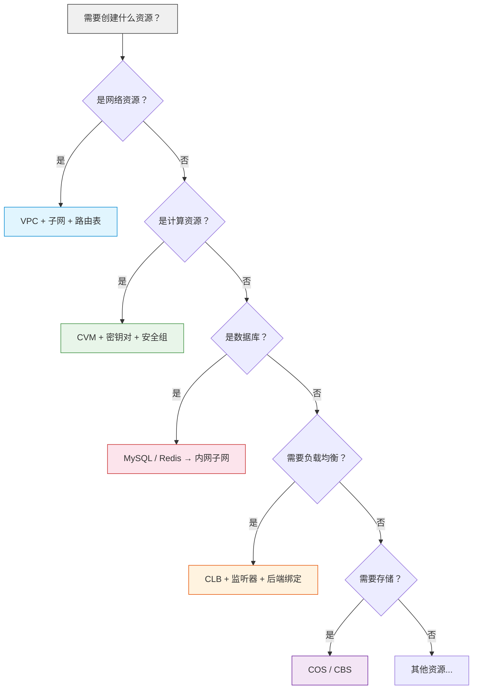

# Phase 3：核心资源实战

> ⏱ **预计用时**：4~5 天（建议分 **Part A 2~3 天 + Part B 2~3 天**）
> 🎯 **目标**：掌握腾讯云核心资源的 Terraform 编排，能搭建完整网络架构

### 本章结构

```
Part A ⭐ 必学（网络 + 计算）     Part B 🔧 选学/进阶（数据库 + 存储 + CLB + 安全组）
┌─────────────────────┐     ┌─────────────────────────────┐
│ 3.1 VPC 网络体系      │     │ 3.3 数据库（MySQL + Redis）  │
│ 3.2 计算资源（CVM+AS） │     │ 3.4 存储（COS + CBS）        │
└─────────────────────┘     │ 3.5 负载均衡 CLB              │
                             │ 3.6 安全组                    │
                             │ 3.7 其他常用资源              │
                             └─────────────────────────────┘
```

> 📝 **学习建议**：不要一天学完！先学 Part A 并动手实践，第二天再学 Part B。每个资源类型都动手创建一遍才能记住。
> 💵 **费用提醒**：本章会创建 CVM、MySQL、Redis、CLB 等多个资源，每小时总费用约 **3~8 元**。学习时请按 Part A → `destroy` → Part B 的顺序，不要一次性创建所有资源！
> 建议在腾讯云控制台 → 费用中心 → 预算管理设置 **100 元预算告警**。

---

## 3.1 VPC 网络体系

### 网络架构示例

```
Internet
 |
[CLB 公网]      [NAT网关 公网]
 |                   |
[公网子网 10.0.1.0/24]    [内网子网 10.0.2.0/24]
 |                   |
 CVM (有公网)        CVM (无公网)
                     MySQL / Redis
```

### 为什么这样设计？

- **公网子网**：放置需要公网访问的 Web 服务器，通过 CLB 或直接绑 EIP 对外提供服务
- **内网子网**：放置数据库、缓存等后端服务，没有公网 IP，只能通过 NAT 网关访问互联网（用于更新软件包等）
- **NAT 网关**：让内网子网的服务器能访问互联网，但互联网不能主动访问它们
- **路由表分离**：公网子网的路由指向 Internet Gateway，内网子网的路由指向 NAT 网关

### 完整 VPC 代码

```hcl
# VPC
resource "tencentcloud_vpc" "main" {
  name       = "prod-vpc"
  cidr_block = "10.0.0.0/16"

  tags = {
    Name        = "prod-vpc"
    Environment = "production"
  }
}

# 公网子网
resource "tencentcloud_subnet" "public" {
  name              = "public-subnet"
  vpc_id            = tencentcloud_vpc.main.id
  cidr_block        = "10.0.1.0/24"
  availability_zone = "ap-guangzhou-3"
  is_multicast      = false
}

# 内网子网
resource "tencentcloud_subnet" "private" {
  name              = "private-subnet"
  vpc_id            = tencentcloud_vpc.main.id
  cidr_block        = "10.0.2.0/24"
  availability_zone = "ap-guangzhou-3"
  is_multicast      = false
}

# 路由表
resource "tencentcloud_route_table" "public" {
  name   = "public-rt"
  vpc_id = tencentcloud_vpc.main.id
}

resource "tencentcloud_route_table" "private" {
  name   = "private-rt"
  vpc_id = tencentcloud_vpc.main.id
}

# 路由表关联子网
resource "tencentcloud_route_table_association" "public" {
  route_table_id = tencentcloud_route_table.public.id
  subnet_id      = tencentcloud_subnet.public.id
}

resource "tencentcloud_route_table_association" "private" {
  route_table_id = tencentcloud_route_table.private.id
  subnet_id      = tencentcloud_subnet.private.id
}

# 创建 EIP（弹性公网 IP）
resource "tencentcloud_eip" "nat" {
  name = "nat-eip"
}

# NAT 网关（内网子网访问互联网）
resource "tencentcloud_nat_gateway" "main" {
  name              = "prod-nat"
  vpc_id            = tencentcloud_vpc.main.id
  max_concurrent    = 1000000
  bandwidth         = 500
  assigned_eip_set  = [tencentcloud_eip.nat.public_ip]  # 注意：这里传入的是 EIP 的 IP 地址，不是 ID
}

# NAT 路由（内网子网 → NAT 网关 → 互联网）
resource "tencentcloud_route_entry" "nat" {
  route_table_id         = tencentcloud_route_table.private.id
  destination_cidr_block = "0.0.0.0/0"
  next_type              = "NAT"
  next_hub               = tencentcloud_nat_gateway.main.id
}

# 公网子网默认路由
resource "tencentcloud_route_entry" "internet" {
  route_table_id         = tencentcloud_route_table.public.id
  destination_cidr_block = "0.0.0.0/0"
  next_type              = "INTERNET_GATEWAY"  # 公网子网通过 Internet Gateway 访问互联网
}
```

### 常见陷阱

| 陷阱 | 说明 |
|------|------|
| **CIDR 重叠** | 如果将来需要做 VPC 对等连接，两个 VPC 的 CIDR 段不能重叠 |
| **子网 CIDR 预留** | 建议预留至少 1/3 的 VPC 地址空间给未来扩展 |
| **NAT 网关带宽** | 生产环境 NAT 网关带宽建议不低于 200Mbps |
| **路由表数量限制** | 腾讯云每 VPC 最多 10 个路由表，需要提前规划 |

> 💡 **CIDR 规划注意事项**：
> - `10.0.0.0/16` 提供 65536 个 IP 地址，适合中小型项目
> - 公网子网建议使用 `/24`（256 个 IP），内网子网同样 `/24`
> - 如果未来可能做 VPC 对等连接，避免使用与其他 VPC 重叠的 CIDR
> - 生产环境建议预留 30%~50% 的地址空间给未来扩容

---

> 📢 **网络搭好了！** 现在 VPC、子网、路由表、NAT 网关都已经就绪。接下来我们把 **计算资源**（CVM 服务器）放进去。

---

## 3.2 计算资源

### 3.2.1 CVM 实例

```hcl
# 查询镜像（Data Source）
data "tencentcloud_images" "default" {
  image_type = ["PUBLIC_IMAGE"]
  os_name    = "TencentOS Server 3.2"
}

# 查询实例类型
data "tencentcloud_instance_types" "default" {
  cpu_core_count = 2
  memory_size    = 4
}

# 创建密钥对（推荐替代密码登录）
resource "tencentcloud_key_pair" "main" {
  key_name   = "prod-key"
  public_key = file("~/.ssh/id_rsa.pub")  # 从本地文件读取公钥
}

# 创建 CVM
resource "tencentcloud_cvm_instance" "web" {
  instance_name     = "web-server-${count.index + 1}"
  availability_zone = "ap-guangzhou-3"
  image_id          = data.tencentcloud_images.default.images[0].image_id
  instance_type     = data.tencentcloud_instance_types.default.instance_types[0].instance_type

  system_disk_type = "CLOUD_SSD"
  system_disk_size = 50

  data_disks {
    data_disk_type = "CLOUD_SSD"
    data_disk_size = 100
  }

  vpc_id    = tencentcloud_vpc.main.id
  subnet_id = tencentcloud_subnet.public.id

  security_groups = [tencentcloud_security_group.web.id]

  internet_max_bandwidth_out = 10
  allocate_public_ip         = true

  # 密钥对（推荐替代密码）
  key_ids = [tencentcloud_key_pair.main.id]

  # 自定义数据（初始化脚本）
  user_data = <<-EOF
    #!/bin/bash
    yum install -y nginx
    systemctl enable nginx
    systemctl start nginx
  EOF

  tags = {
    Name = "web-server-${count.index + 1}"
  }

  count = var.instance_count
}

# --- 需要在 variables.tf 中定义以下变量 ---
# variable "instance_count" {
#   description = "CVM 实例数量"
#   type        = number
#   default     = 1
# }

> 📢 **CVM 创建注意事项**：
> - `key_ids` 和 `password` 二选一，推荐使用密钥对
> - `user_data` 仅在首次启动时执行，重启不会再次执行
> - `security_groups` 传入的是一个安全组 ID 列表
> - `allocate_public_ip = true` 才会分配公网 IP

### 3.2.2 弹性伸缩（Auto Scaling）

弹性伸缩 AS（Auto Scaling）根据业务负载自动调整 CVM 实例数量，是生产环境高可用的关键组件。

```hcl
# 启动配置
resource "tencentcloud_as_scaling_config" "launch" {
  configuration_name = "web-launch-config"
  image_id           = data.tencentcloud_images.default.images[0].image_id
  instance_types     = ["S5.LARGE8"]

  system_disk_type = "CLOUD_SSD"
  system_disk_size = 50

  internet_charge_type       = "TRAFFIC_POSTPAID_BY_HOUR"
  internet_max_bandwidth_out = 10
  public_ip_assigned         = true

  key_ids = [tencentcloud_key_pair.main.id]

  security_group_ids = [tencentcloud_security_group.web.id]

  user_data = <<-EOF
    #!/bin/bash
    echo "Starting web server..." > /var/log/startup.log
  EOF
}

# 伸缩组
resource "tencentcloud_as_scaling_group" "web" {
  scaling_group_name   = "web-asg"
  scaling_config_id    = tencentcloud_as_scaling_config.launch.id
  vpc_id               = tencentcloud_vpc.main.id
  subnet_ids           = [tencentcloud_subnet.public.id]
  project_id           = 0
  max_size             = 5
  min_size             = 1
  desired_size         = 2
  removal_policy       = "REMOVE_OLDEST_INSTANCE"
  default_cooldown     = 300

  # 关联 CLB
  load_balancer_ids = [tencentcloud_clb_instance.main.id]
}

# 伸缩策略（CPU 超过 70% 扩容 → 增加 1 台实例）
resource "tencentcloud_as_scaling_policy" "scale_up" {
  scaling_group_id    = tencentcloud_as_scaling_group.web.id
  policy_name         = "cpu-scale-up"
  adjustment_type     = "CHANGE_IN_CAPACITY"   # 调整容量，而非设置为精确值
  adjustment_value    = 1                       # 增加 1 台实例
  cooldown            = 300

  metric {
    metric_name          = "CPU_UTILIZATION"
    statistic            = "AVERAGE"
    threshold            = 70
    comparison_operator  = "GREATER_THAN"
    period               = 60
    continuous_time      = 5
  }
}

# 伸缩策略（CPU 低于 30% 缩容 → 减少 1 台实例）
resource "tencentcloud_as_scaling_policy" "scale_down" {
  scaling_group_id    = tencentcloud_as_scaling_group.web.id
  policy_name         = "cpu-scale-down"
  adjustment_type     = "CHANGE_IN_CAPACITY"   # 调整容量
  adjustment_value    = -1                      # 减少 1 台实例
  cooldown            = 300

  metric {
    metric_name          = "CPU_UTILIZATION"
    statistic            = "AVERAGE"
    threshold            = 30
    comparison_operator  = "LESS_THAN"
    period               = 60
    continuous_time      = 5
  }
}
```

> 💡 **关于 `adjustment_type` 的说明**：
> - `CHANGE_IN_CAPACITY`：增加或减少指定数量的实例（调整值可正可负）
> - `EXACT_CAPACITY`：将实例数设置为精确值（调整值必须为正整数）
> - `PERCENT_CHANGE_IN_CAPACITY`：按百分比调整
>
> 扩容应该用 `CHANGE_IN_CAPACITY` + 正数，缩容用 `CHANGE_IN_CAPACITY` + 负数。

---

> ⏸️ **Part A 结束，建议休息一下！**
>
> 你已经学完了 **网络（VPC/子网/路由）** 和 **计算（CVM/AS）** 两大块。
> 建议先动手实践，再继续往下学。
> **动手实践**：
> 1. 用你学到的 VPC + CVM 代码创建一套基础环境
> 2. 用 SSH 登录 CVM 看看
> 3. 执行 `terraform destroy` 清理
>
> 以下开始 **Part B：数据库 + 存储 + 负载均衡**

---

## 3.3 数据库

### 3.3.1 TencentDB for MySQL

> 💵 **费用提醒**：MySQL 4C8G 200GB 按量计费约 **1.5~2 元/小时**，一天约 40 元。
> 如果只是学习，建议创建后 1 小时内验证完毕并 `destroy`，避免高额账单！

```hcl
# 创建安全组和安全组规则（见 3.6 节）
# 此处假设已创建 tencentcloud_security_group.mysql

# 创建 MySQL 主实例
resource "tencentcloud_mysql_instance" "main" {
  instance_name  = "prod-mysql"
  mem_size       = 4000    # 4GB
  cpu_core_count = 4
  volume_size    = 200     # 200GB

  engine_version    = "8.0"
  charge_type       = "POSTPAID"
  device_type       = "UNIVERSAL"  # 通用型
  availability_zone = "ap-guangzhou-3"

  vpc_id    = tencentcloud_vpc.main.id
  subnet_id = tencentcloud_subnet.private.id

  # 安全组
  security_groups = [tencentcloud_security_group.mysql.id]

  # 自动续费
  auto_renew_flag = 1
  force_delete    = true    # 允许 terraform destroy 时强制删除

  parameters = {
    character_set_server = "utf8mb4"
    max_connections      = "1000"
  }

  tags = {
    Name        = "prod-mysql"
    Environment = "production"
  }
}

# MySQL 只读实例
resource "tencentcloud_mysql_readonly_instance" "readonly" {
  instance_name      = "prod-mysql-ro"
  master_instance_id = tencentcloud_mysql_instance.main.id
  mem_size           = 4000
  volume_size        = 200
  device_type        = "UNIVERSAL"
  zone               = "ap-guangzhou-4"  # 跨可用区部署
  vpc_id             = tencentcloud_vpc.main.id
  subnet_id          = tencentcloud_subnet.private.id

  security_groups = [tencentcloud_security_group.mysql.id]
}

# 数据库账号
resource "tencentcloud_mysql_account" "app" {
  mysql_id = tencentcloud_mysql_instance.main.id
  name     = "app_user"
  password = var.mysql_password
  host     = "%"    # % 表示允许任意 IP 连接
}

# --- 需要在 variables.tf 中定义以下变量 ---
# variable "mysql_password" {
#   description = "MySQL 数据库密码"
#   type        = string
#   sensitive   = true
# }

# 创建数据库
resource "tencentcloud_mysql_database" "app" {
  mysql_id      = tencentcloud_mysql_instance.main.id
  db_name       = "app_database"
  character_set = "utf8mb4"
}

# 账号授权
resource "tencentcloud_mysql_privilege" "app" {
  mysql_id       = tencentcloud_mysql_instance.main.id
  account_name   = tencentcloud_mysql_account.app.name
  account_host   = tencentcloud_mysql_account.app.host
  global         = ["SELECT", "INSERT", "UPDATE", "DELETE", "CREATE", "ALTER"]
  database       = tencentcloud_mysql_database.app.db_name
  database_privileges = ["SELECT", "INSERT", "UPDATE", "DELETE", "CREATE", "ALTER"]
}
```

> 📢 **MySQL 设计要点**：
> - 主库和只读实例部署在不同可用区，实现跨可用区高可用
> - 数据库部署在**内网子网**，不暴露公网
> - `force_delete = true` 允许 Terraform 删除 MySQL 实例（生产环境慎用！）
> - `character_set_server = "utf8mb4"` 支持完整的 Unicode，包括 emoji

### 3.3.2 TencentDB for Redis

> 💵 **费用提醒**：Redis 4GB 标准版按量计费约 **0.5~0.8 元/小时**，一天约 15 元。

```hcl
resource "tencentcloud_redis_instance" "main" {
  type_id           = 6               # 6=标准版（主从架构），7=集群版（type 参数已弃用，请使用 type_id）
  name              = "prod-redis"
  zone              = "ap-guangzhou-3"
  mem_size          = 4096           # 4GB
  charge_type       = "POSTPAID"
  port              = 6379
  vpc_id            = tencentcloud_vpc.main.id
  subnet_id         = tencentcloud_subnet.private.id
  security_groups   = [tencentcloud_security_group.redis.id]
  password          = var.redis_password

  # 自动续费
  auto_renew_flag   = 1
  no_auth           = false   # 需要密码认证
  tags = {
    Name        = "prod-redis"
    Environment = "production"
  }
}

# --- 需要在 variables.tf 中定义以下变量 ---
# variable "redis_password" {
#   description = "Redis 密码"
#   type        = string
#   sensitive   = true
# }

> 💡 **Redis 注意点**：
> - `type_id = 6` 是标准版（主从架构），`type_id = 7` 是集群版（`type` 参数已弃用，请使用 `type_id`）
> - Redis 密码要求：长度 8-64 位，至少包含大写字母、小写字母、数字和特殊字符中的三种
> - `no_auth = false` 表示需要密码认证，生产环境必须开启

---

> 📢 **数据库就绪！** MySQL 存结构化数据，Redis 做缓存加速。接下来我们把 **静态文件**（图片、视频、备份）存到对象存储里。

---

## 3.4 存储

### 3.4.1 对象存储 COS

```hcl
# COS Bucket
resource "tencentcloud_cos_bucket" "static" {
  bucket = "prod-static-${var.app_id}"  # 全局唯一，不能和其他用户重复
  acl    = "private"

  # 版本控制（注意：versioning_enable 没有末尾的 d）
  versioning_enable = true

  # 服务端加密
  encryption_algorithm = "AES256"

  # 生命周期规则
  lifecycle_rule {
    id      = "logs"
    enabled = true
    prefix  = "logs/"

    expiration {
      days = 90
    }
  }

  tags = {
    Name        = "prod-static"
    Environment = "production"
  }
}

# COS 对象上传
resource "tencentcloud_cos_bucket_object" "index" {
  bucket = tencentcloud_cos_bucket.static.bucket
  key    = "index.html"
  source = "../static/index.html"
  etag   = filemd5("../static/index.html")
}
```

# --- 需要在 variables.tf 中定义以下变量 ---
# variable "app_id" {
#   description = "应用 ID（用于 Bucket 唯一命名）"
#   type        = string
# }

> 📢 **COS 设计要点**：
> - Bucket 名称**全局唯一**，建议使用 `项目-环境-appid` 的命名格式
> - `versioning_enable = true` 开启版本控制，防止误删文件（注意参数名是 `versioning_enable`，没有末尾的 d）
> - 生命周期规则自动清理过期日志，节省存储成本
> - `acl = "private"` 表示私有读写，不对外公开

### 3.4.2 云硬盘 CBS

```hcl
# 创建云硬盘
resource "tencentcloud_cbs_storage" "data" {
  storage_name      = "data-disk"
  storage_type      = "CLOUD_SSD"
  storage_size      = 200
  availability_zone = "ap-guangzhou-3"
  project_id        = 0
  charge_type       = "POSTPAID"

  tags = {
    Name = "data-disk"
  }
}

# 挂载到 CVM
resource "tencentcloud_cbs_storage_attachment" "data" {
  storage_id  = tencentcloud_cbs_storage.data.id
  instance_id = tencentcloud_cvm_instance.web[0].id
}

# 定期快照策略
resource "tencentcloud_cbs_snapshot_policy" "daily" {
  snapshot_policy_name = "daily-snapshot"
  repeat_hours         = [2]           # 每天凌晨 2 点
  repeat_weekdays      = [1, 2, 3, 4, 5, 6, 7]
  retention_days       = 30
}

# 关联快照策略到云硬盘
resource "tencentcloud_cbs_snapshot_policy_attachment" "daily" {
  storage_id         = tencentcloud_cbs_storage.data.id
  snapshot_policy_id = tencentcloud_cbs_snapshot_policy.daily.id
}
```

> 💡 **CBS 注意**：挂载到 CVM 后，还需要在操作系统内**手动格式化并挂载**文件系统，Terraform 不会自动完成这一步。

---

> 📢 **存储就绪！** 现在有 COS（对象存储）放静态文件，CBS（云硬盘）挂载到 CVM 做数据盘。最后一步，我们加一个**负载均衡器**，把用户流量分发到多台 CVM 上。

---

## 3.5 负载均衡 CLB

### CLB 的层级关系

理解 CLB 的层级关系非常重要：

```
CLB 实例（tencentcloud_clb_instance）
  └── 监听器（tencentcloud_clb_listener）— 监听端口和协议
        ├── TCP/UDP 监听器 → 直接绑定后端目标
        └── HTTP/HTTPS 监听器
              └── 转发规则（tencentcloud_clb_listener_rule）— 域名和路径规则
                    └── 后端目标（tencentcloud_clb_attachment）— 实际处理请求的 CVM
```

- **Layer 4 协议（TCP/UDP）**：监听器直接绑定后端目标，不需要转发规则
- **Layer 7 协议（HTTP/HTTPS）**：监听器通过转发规则（域名/路径）分发请求到后端目标

### 完整 CLB 配置

> 💵 **费用提醒**：公网 CLB 按量计费约 **0.2 元/小时**，一天约 5 元。

```hcl
# 公网 CLB 实例
resource "tencentcloud_clb_instance" "main" {
  clb_name             = "prod-web-clb"
  network_type         = "OPEN"          # 公网类型（INTERNAL 为内网类型）
  vpc_id               = tencentcloud_vpc.main.id
  subnet_id            = tencentcloud_subnet.public.id
  project_id           = 0
  internet_charge_type = "TRAFFIC_POSTPAID_BY_HOUR"

  tags = {
    Name = "prod-web-clb"
  }
}

# CLB 监听器（HTTP:80）
resource "tencentcloud_clb_listener" "http" {
  clb_id        = tencentcloud_clb_instance.main.id
  listener_name = "http"
  port          = 80
  protocol      = "HTTP"
}

# CLB 监听器（HTTPS:443）— 单向认证，MUTUAL 双向认证需额外配置 CA 证书
resource "tencentcloud_clb_listener" "https" {
  clb_id              = tencentcloud_clb_instance.main.id
  listener_name       = "https"
  port                = 443
  protocol            = "HTTPS"
  certificate_id      = var.ssl_certificate_id
  certificate_ssl_mode = "UNIDIRECTIONAL"  # 单向认证（MUTUAL 双向认证需额外配置 CA 证书）
}

# 监听器转发规则（仅 HTTP/HTTPS 监听器需要）
resource "tencentcloud_clb_listener_rule" "api" {
  clb_id              = tencentcloud_clb_instance.main.id
  listener_id         = tencentcloud_clb_listener.http.listener_id
  domain              = "api.example.com"
  url                 = "/"
  health_check_switch = true
  health_check_http_code = 200
}

# 后端目标绑定（将 CVM 注册到 CLB 监听器）
# 注意：TCP/UDP 监听器直接绑定到 listener；HTTP/HTTPS 绑定到 rule
resource "tencentcloud_clb_attachment" "web" {
  clb_id      = tencentcloud_clb_instance.main.id
  listener_id = tencentcloud_clb_listener.http.listener_id
  rule_id     = tencentcloud_clb_listener_rule.api.rule_id  # HTTP/HTTPS listener 需要指定 rule_id

  targets {
    instance_id = tencentcloud_cvm_instance.web[0].id
    port        = 80
    weight      = 10
  }
  targets {
    instance_id = tencentcloud_cvm_instance.web[1].id
    port        = 80
    weight      = 10
  }
}
```

# --- 需要在 variables.tf 中定义以下变量 ---
# variable "ssl_certificate_id" {
#   description = "SSL 证书 ID（CLB HTTPS 监听器使用）"
#   type        = string
# }

> 💡 **CLB 常见陷阱**：
> - `http_forward` 不是 CLB 监听器的参数，HTTP 转发是通过 `tencentcloud_clb_listener_rule` 实现的
> - HTTP/HTTPS 监听器绑定后端目标时必须指定 `rule_id`
> - TCP/UDP 监听器绑定后端目标时不需要 `rule_id`
> - CLB 创建后需要等 1-2 分钟才能完全生效
> - 公网 CLB 的 `subnet_id` 是必填的

---

## 3.6 安全组

### 安全组设计原则

安全组是腾讯云的网络访问控制层，遵循以下原则：
1. **最小权限原则**：只开放必要的端口
2. **安全组引用**：数据库安全组引用 Web 安全组，而不是写死 IP 地址
3. **分层设计**：Web 层、应用层、数据层各自独立的安全组

### 安全组引用（Security Group Reference）

安全组引用是腾讯云安全组的重要特性：允许来自另一个安全组的所有实例的流量，而无需关心这些实例的 IP 地址变化。

```hcl
# 安全组定义
resource "tencentcloud_security_group" "web" {
  name        = "web-sg"
  description = "Web server security group"
  project_id  = 0

  tags = {
    Name = "web-sg"
  }
}

resource "tencentcloud_security_group" "mysql" {
  name        = "mysql-sg"
  description = "MySQL security group"
  project_id  = 0
}

resource "tencentcloud_security_group" "redis" {
  name        = "redis-sg"
  description = "Redis security group"
  project_id  = 0
}

# Web 安全组规则
resource "tencentcloud_security_group_rule" "web_http" {
  security_group_id = tencentcloud_security_group.web.id
  type              = "ingress"
  cidr_ip           = "0.0.0.0/0"
  ip_protocol       = "tcp"
  port_range        = "80,443"
  policy            = "accept"
  description       = "HTTP/HTTPS from internet"
}

resource "tencentcloud_security_group_rule" "web_ssh" {
  security_group_id = tencentcloud_security_group.web.id
  type              = "ingress"
  cidr_ip           = var.admin_ip  # 限制为管理 IP，不要设成 0.0.0.0/0
  ip_protocol       = "tcp"
  port_range        = "22"
  policy            = "accept"
  description       = "SSH from admin"
}

resource "tencentcloud_security_group_rule" "web_outbound" {
  security_group_id = tencentcloud_security_group.web.id
  type              = "egress"
  cidr_ip           = "0.0.0.0/0"
  ip_protocol       = "ALL"
  policy            = "accept"
  description       = "All outbound traffic"
}

# MySQL 安全组规则（仅允许 Web 服务器访问）
# 使用 source_security_group_id 引用 Web 安全组
resource "tencentcloud_security_group_rule" "mysql_in" {
  security_group_id        = tencentcloud_security_group.mysql.id
  type                     = "ingress"
  ip_protocol              = "tcp"
  port_range               = "3306"
  policy                   = "accept"
  source_security_group_id = tencentcloud_security_group.web.id  # 引用安全组 ID
  description              = "MySQL from web SG"
}

# Redis 安全组规则
resource "tencentcloud_security_group_rule" "redis_in" {
  security_group_id        = tencentcloud_security_group.redis.id
  type                     = "ingress"
  ip_protocol              = "tcp"
  port_range               = "6379"
  policy                   = "accept"
  source_security_group_id = tencentcloud_security_group.web.id
  description              = "Redis from web SG"
}
```

# --- 需要在 variables.tf 中定义以下变量 ---
# variable "admin_ip" {
#   description = "管理 IP 地址段（用于 SSH 访问限制）"
#   type        = string
#   default     = "0.0.0.0/0"
# }

> 💡 **安全组引用 vs CIDR 的区别**：
> - `source_security_group_id`：引用安全组 ID，动态生效（实例 IP 变化不受影响）
> - `cidr_ip`：指定 IP 地址段，静态
> - 两者不能同时使用，二选一
> - 注意参数名是 `source_security_group_id`（不是 `source_security_group`）

---

## 3.7 其他常用资源

### DNS 解析（DNSPod）

```hcl
# 将域名解析到 CLB 的 VIP
# 注意：clb_vips 是复数属性，返回列表，使用 [0] 取第一个 VIP
resource "tencentcloud_dnspod_record" "www" {
  domain      = "example.com"
  record_type = "A"
  record_line = "默认"
  value       = tencentcloud_clb_instance.main.clb_vips[0]
  sub_domain  = "www"
  ttl         = 600
}
```

### SSL 证书

```hcl
# 查询 SSL 证书
data "tencentcloud_ssl_certificates" "cert" {
  name = "example.com"
}

# 在 CLB 监听器中使用证书
resource "tencentcloud_clb_listener" "https" {
  clb_id         = tencentcloud_clb_instance.main.id
  listener_name  = "https"
  port           = 443
  protocol       = "HTTPS"
  certificate_id = data.tencentcloud_ssl_certificates.cert.certificates[0].id
}
```

### 消息队列 CKafka（选读）

```hcl
resource "tencentcloud_ckafka_instance" "main" {
  instance_name   = "prod-kafka"
  zone_id         = 100003  # ap-guangzhou-3 对应的 zone_id
  spec_bandwidth  = 40      # MB/s
  disk_size       = 500     # GB
  vpc_id          = tencentcloud_vpc.main.id
  subnet_id       = tencentcloud_subnet.private.id
  charge_type     = "POSTPAID"
  kafka_version   = "2.8.1"
  multi_zone_flag = false
}
```

> 📢 **Zone ID 查询**：可用区对应的 `zone_id` 可以通过 `data "tencentcloud_availability_zones" "default" {}` 查询，或者参考腾讯云文档：广州三区 = 100003，广州四区 = 100004，广州六区 = 100006。

---

## 🎯 互动练习

### 自测题

<details>
<summary>📝 第 1 题：为什么数据库要部署在内网子网而不是公网子网？</summary>

**答案**：安全。内网子网没有公网访问能力，数据库只能通过内网 IP 访问，避免了数据库被公网扫描和攻击的风险。应用服务器通过内网连接数据库，速度更快且更安全。
</details>

<details>
<summary>📝 第 2 题：NAT 网关的作用是什么？</summary>

A) 提供公网 IP  
B) 让内网子网的资源可以访问互联网（但不能从互联网访问内网）  
C) 负载均衡  
D) 防火墙  
**答案：B**。NAT 网关为内网子网的资源提供出站互联网访问能力，但不允许入站连接。这是"单向"的。
</details>

<details>
<summary>📝 第 3 题：CLB 的层级关系是什么？</summary>

**答案**：`CLB 实例 → 监听器 → 转发规则（仅 HTTP/HTTPS）→ 后端目标`
- 监听器定义端口和协议（80/HTTP 或 443/HTTPS）
- 转发规则定义域名和路径（`api.example.com/api/`）
- 后端目标是实际的 CVM 实例
</details>

<details>
<summary>📝 第 4 题：安全组引用（`source_security_group_id`）和 CIDR 有什么区别？</summary>

**答案**：CIDR 基于 IP 地址范围控制访问，安全组引用基于"资源身份"控制。用安全组引用时"只要是 Web 服务器的流量就放行"，不需要关心 Web 服务器的 IP 是什么——即使 IP 变了也能自动适配。
</details>

### 🛠️ 动手试一试

**Part A 练习**：
1. 修改 VPC 的 CIDR 从 `10.0.0.0/16` 改为 `172.16.0.0/16`，观察 `plan` 输出（提示：VPC 不可修改，会重建）
2. 给安全组增加一条规则：开放 8080 端口，然后 `apply` 观察 `~` 修改

**Part B 练习**：
3. 创建一个 COS Bucket，上传一个文件，然后在控制台查看
4. 修改 CLB 的监听器端口从 80 改为 8080，观察 plan 输出

### 🔧 决策流程图



---

## ✅ 本阶段掌握要点

- [ ] 设计 VPC 网络架构（公网/内网子网、NAT 网关）
- [ ] 理解 CIDR 规划和路由表设计
- [ ] 使用 Data Source 查询镜像和实例类型
- [ ] 创建 CVM 实例并配置密钥对和初始化脚本
- [ ] 配置弹性伸缩组和伸缩策略（理解 `CHANGE_IN_CAPACITY` 的正确用法）
- [ ] 创建 MySQL 主从架构（主实例 + 只读实例 + 账号 + 数据库 + 授权）
- [ ] 创建 Redis 实例（使用 `type_id` 而非 `type`）
- [ ] 创建 COS Bucket 并配置生命周期（`versioning_enable` 无末尾 d）
- [ ] 创建和挂载 CBS 云硬盘及快照策略
- [ ] 理解 CLB 的层级关系（实例 → 监听器 → 规则 → 后端目标）
- [ ] 配置 CLB 负载均衡（HTTP/HTTPS）
- [ ] 编写安全组规则（含安全组引用 `source_security_group_id`）
- [ ] 配置 DNS 解析和 SSL 证书
- [ ] 使用 `clb_vips[0]` 引用 CLB 的公网 IP

---

**下一步 →** [04-进阶技巧.md](04-进阶技巧.md)