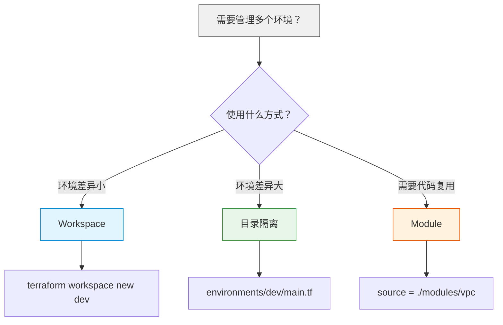

# Phase 4：进阶技巧

> ⏱ **预计用时**：3~4 天
> 🎯 **目标**：掌握模块化、远程 State、多环境管理、动态资源等核心进阶能力

---

## 4.1 Module 模块化

### 为什么需要 Module？

```
❌ 单体项目的问题：
    main.tf 有 500+ 行，难以维护
    多个项目重复代码
    无法复用和共享
    无法团队协作

✅ Module 的优势：
    封装复用，一次编写多处使用
    版本化管理（支持 Git Tag / Registry）
    职责清晰，团队分工
    降低复杂度
```

### 模块目录结构

```bash
modules/
├── vpc/                  # VPC 模块
│   ├── main.tf
│   ├── variables.tf
│   ├── outputs.tf
│   └── README.md
├── cvm/                  # CVM 模块
│   ├── main.tf
│   ├── variables.tf
│   └── outputs.tf
├── mysql/                # MySQL 模块
│   ├── main.tf
│   ├── variables.tf
│   └── outputs.tf
├── clb/                  # CLB 模块
│   ├── main.tf
│   ├── variables.tf
│   └── outputs.tf
└── security_group/       # 安全组模块
    ├── main.tf
    ├── variables.tf
    └── outputs.tf
```

### 模块设计原则

1. **单一职责**：每个模块只做一件事（VPC 模块只负责网络，不负责数据库）
2. **输入明确**：所有需要外部传入的参数都定义为变量，不要硬编码
3. **输出完整**：对外暴露所有可能被引用的值
4. **文档化**：每个模块都有 README 说明用途和用法

### 示例：VPC 模块

**modules/vpc/main.tf**

```hcl
resource "tencentcloud_vpc" "main" {
  name       = var.vpc_name
  cidr_block = var.vpc_cidr

  tags = var.tags
}

resource "tencentcloud_subnet" "public" {
  count = length(var.public_subnet_cidrs)

  name              = "${var.vpc_name}-public-${count.index + 1}"
  vpc_id            = tencentcloud_vpc.main.id
  cidr_block        = var.public_subnet_cidrs[count.index]
  availability_zone = var.availability_zones[count.index % length(var.availability_zones)]
  is_multicast      = false
}

resource "tencentcloud_subnet" "private" {
  count = length(var.private_subnet_cidrs)

  name              = "${var.vpc_name}-private-${count.index + 1}"
  vpc_id            = tencentcloud_vpc.main.id
  cidr_block        = var.private_subnet_cidrs[count.index]
  availability_zone = var.availability_zones[count.index % length(var.availability_zones)]
  is_multicast      = false
}
```

**modules/vpc/variables.tf**

```hcl
variable "vpc_name" {
  description = "VPC 名称"
  type        = string
}

variable "vpc_cidr" {
  description = "VPC CIDR 段"
  type        = string
}

variable "public_subnet_cidrs" {
  description = "公网子网 CIDR 列表"
  type        = list(string)
}

variable "private_subnet_cidrs" {
  description = "内网子网 CIDR 列表"
  type        = list(string)
}

variable "availability_zones" {
  description = "可用区列表"
  type        = list(string)
}

variable "tags" {
  description = "资源标签"
  type        = map(string)
  default     = {}
}
```

**modules/vpc/outputs.tf**

```hcl
output "vpc_id" {
  description = "VPC ID"
  value       = tencentcloud_vpc.main.id
}

output "vpc_cidr" {
  description = "VPC CIDR 段"
  value       = tencentcloud_vpc.main.cidr_block
}

output "public_subnet_ids" {
  description = "公网子网 ID 列表"
  value       = tencentcloud_subnet.public[*].id
}

output "private_subnet_ids" {
  description = "内网子网 ID 列表"
  value       = tencentcloud_subnet.private[*].id
}
```

### 使用模块

```hcl
# 本地模块
module "vpc" {
  source = "./modules/vpc"

  vpc_name            = "prod-vpc"
  vpc_cidr            = "10.0.0.0/16"
  public_subnet_cidrs  = ["10.0.1.0/24", "10.0.3.0/24"]
  private_subnet_cidrs = ["10.0.2.0/24", "10.0.4.0/24"]
  availability_zones   = ["ap-guangzhou-3", "ap-guangzhou-4"]
  tags = {
    Environment = "production"
  }
}

# 引用模块输出
resource "tencentcloud_cvm_instance" "web" {
  vpc_id    = module.vpc.vpc_id
  subnet_id = module.vpc.public_subnet_ids[0]
  # ...
}
```

### 模块源（Source）

```hcl
# 本地路径（适用于单体项目内的模块）
module "vpc" {
  source = "./modules/vpc"
}

# Git 仓库（推荐内部共享，支持版本控制）
module "vpc" {
  source = "git::https://github.com/your-org/terraform-modules.git//vpc?ref=v1.2.0"
  #                                      ^^                                    ^^
  #                                     双斜杠表示模块在仓库中的路径  Git Tag 作为版本
}

# Terraform Registry（公开模块，社区共享）
module "vpc" {
  source  = "terraform-tencentcloud-modules/vpc/tencentcloud"
  version = "1.0.0"
}
```

### 模块版本管理

```hcl
# 使用版本约束确保模块版本稳定
module "vpc" {
  source  = "terraform-tencentcloud-modules/vpc/tencentcloud"
  version = "~> 1.0"  # 允许 1.x 版本，但不允许 2.0
}

# 版本约束语法：
# >= 1.0.0     → 大于等于 1.0.0
# ~> 1.0.0     → 允许 1.0.x
# ~> 1.0       → 允许 1.x
# >= 1.0, < 2.0 → 1.x 版本范围内
```

---

## 4.2 远程 State（COS 后端）

### 为什么需要远程 State？

```
❌ 本地 State 的问题：
    文件丢失 = 灾难
    多人协作冲突
    无法锁定（防止并发写入）
    无法在 CI/CD 中使用
✅ 远程 State 的优势：
    安全存储（COS 持久化）
    状态锁定（防止并发冲突）
    团队协作（共享同一个 State）
    CI/CD 集成
```

### COS 后端配置

**重要前提：Bucket 需要提前创建！**

> 💡 **COS 后端 Bucket 必须提前手动创建！** Terraform 在 `terraform init` 时就会尝试连接后端存储，如果 Bucket 不存在，初始化会失败。你不能用同一个 Terraform 项目来创建存储 State 的 Bucket（鸡生蛋蛋生鸡的问题）。
>
> **创建 Bucket 的两种方式：**
>
> 1. **手动创建（推荐）**：在腾讯云 COS 控制台创建一个 Bucket，如 `company-terraform-state`
> 2. **独立项目创建**：用一个单独的 Terraform 项目只创建 COS Bucket，然后其他项目引用它

### COS 后端配置示例

```hcl
terraform {
  backend "cos" {
    bucket = "company-terraform-state"   # 必须提前创建（不包含 APPID）
    region = "ap-guangzhou"
    prefix = "env/prod"                  # 环境隔离前缀
    key    = "terraform.tfstate"         # State 文件名
  }
}
```

> **注意**：COS 控制台创建 Bucket 时会自动追加 APPID 后缀（如 `company-terraform-state-1300000000`），但 Terraform COS 后端配置中只填写原始名称，SDK 会自动补全。如果要用 `-backend-config` 参数传入，则需使用控制台中的完整 Bucket 名称。

### 完整初始化流程

```bash
# 1. 先手动创建一个 COS Bucket 用于存储 State
#    登录 COS 控制台 → 创建 Bucket → 名称填 company-terraform-state

# 2. 配置 backend 后初始化
terraform init
# 输出：
#   Initializing the backend...
#   Successfully configured the backend "cos"!
#   Terraform has been successfully initialized!

# 3. 之后所有操作自动同步到 COS
terraform plan
terraform apply
```

### 使用前缀隔离不同环境

```hcl
# 生产环境
terraform {
  backend "cos" {
    bucket = "company-terraform-state"
    region = "ap-guangzhou"
    prefix = "env/prod"           # 生产环境的 State 在 env/prod/ 目录下
    key    = "terraform.tfstate"
  }
}

# 测试环境
terraform {
  backend "cos" {
    bucket = "company-terraform-state"
    region = "ap-guangzhou"
    prefix = "env/test"           # 测试环境的 State 在 env/test/ 目录下
    key    = "terraform.tfstate"
  }
}
```

### 部分配置（Partial Configuration）

部分配置将 backend 配置从代码中分离，让初始化时动态传入参数，避免在每个环境目录中硬编码配置。

```hcl
# main.tf 中只声明 backend 类型，不写具体参数
terraform {
  backend "cos" {}
}
```

```bash
# 初始化时传入参数
terraform init \
  -backend-config="bucket=company-terraform-state" \
  -backend-config="region=ap-guangzhou" \
  -backend-config="prefix=env/prod" \
  -backend-config="key=terraform.tfstate"
```

这种做法在 CI/CD 中非常有用，可以动态决定环境而无需修改代码。

### 使用 terraform_remote_state 读取其他项目的 State

```hcl
# 读取网络团队的 State 获取 VPC ID
data "terraform_remote_state" "network" {
  backend = "cos"
  config = {
    bucket = "company-terraform-state"
    region = "ap-guangzhou"
    prefix = "env/prod"
    key    = "network/terraform.tfstate"
  }
}

# 使用网络团队创建的 VPC
resource "tencentcloud_cvm_instance" "web" {
  vpc_id = data.terraform_remote_state.network.outputs.vpc_id
}
```

> 💡 **注意**：`terraform_remote_state` 读取的是 State 中的输出值，所以被引用的项目必须定义了相应的 output。

---

## 4.3 Workspace 多环境管理

### Workspace 概念

Workspace 允许在同一个项目目录下管理多个环境（dev/staging/prod），本质上是共享同一套代码但使用不同的 State 文件。

```
同一个目录
├── main.tf, variables.tf, outputs.tf   → 共享代码
├── terraform.tfstate.d/                → 本地 Workspace State 目录
│   ├── dev/
│   │   └── terraform.tfstate
│   ├── staging/
│   │   └── terraform.tfstate
│   └── prod/
│       └── terraform.tfstate
└── terraform.tfstate                   → default workspace 的 State
```

### 使用 COS 后端时 Workspace 的 State 存储位置

当使用 COS 后端时，Workspace 的 State 存储路径会自动结合 workspace 名称：

```hcl
# 配置（不指定 prefix）
terraform {
  backend "cos" {
    bucket = "company-terraform-state"
    region = "ap-guangzhou"
    prefix = "myapp"    # 基础前缀
    key    = "terraform.tfstate"
  }
}
```

```
COS 中的实际存储路径：
env:/myapp/default/terraform.tfstate          → default workspace
env:/myapp/dev/terraform.tfstate              → dev workspace
env:/myapp/staging/terraform.tfstate          → staging workspace
env:/myapp/prod/terraform.tfstate             → prod workspace
```

Terraform 自动在 `prefix` 后面追加 `env:/<workspace_name>` 路径，不同 workspace 的 State 文件完全隔离。

### 操作命令

```bash
# 查看所有 workspace
terraform workspace list
# 输出：
#   default
# * dev       → * 表示当前 workspace

# 创建新 workspace
terraform workspace new dev
terraform workspace new staging
terraform workspace new prod

# 切换 workspace
terraform workspace select dev

# 查看当前 workspace
terraform workspace show
```

### 在代码中使用 Workspace

```hcl
# 根据环境设置不同配置
locals {
  # 环境配置映射
  env_config = {
    dev = {
      instance_type   = "S5.LARGE8"    # 2C4G
      instance_count  = 1
      mysql_mem_size  = 2000
      mysql_volume    = 50
    }
    staging = {
      instance_type   = "S5.LARGE8"     # 2C4G
      instance_count  = 2
      mysql_mem_size  = 4000
      mysql_volume    = 100
    }
    prod = {
      instance_type   = "S5.4XLARGE32"  # 16C32G
      instance_count  = 3
      mysql_mem_size  = 16000
      mysql_volume    = 500
    }
    default = {
      instance_type   = "S5.LARGE8"
      instance_count  = 1
      mysql_mem_size  = 2000
      mysql_volume    = 50
    }
  }
}

# 获取当前环境的配置
locals {
  current_config = lookup(local.env_config, terraform.workspace, local.env_config["default"])
}

# 根据环境名称设置资源名称
locals {
  environment = terraform.workspace
  name_prefix = "myapp-${local.environment}"
}

# 使用环境配置
resource "tencentcloud_cvm_instance" "web" {
  instance_name = "${local.name_prefix}-web"
  instance_type = local.current_config.instance_type
  count         = local.current_config.instance_count
  # ...
}

resource "tencentcloud_mysql_instance" "main" {
  instance_name = "${local.name_prefix}-mysql"
  mem_size      = local.current_config.mysql_mem_size
  # ...
}
```

### Workspace vs 目录隔离

```
Workspace 适用场景：
  - 同一项目，不同环境
  - 环境差异较小（主要是规格不同）
  - 共用一个后端 Bucket
  - 适合单人开发或小团队
目录隔离（Phase 5 推荐）：
  - 环境差异较大（不同 VPC、不同区域）
  - 每个环境独立目录，完全解耦
  - 更严格的权限控制（生产环境只有 CI/CD 可操作）
  - 生产环境更安全
  - 适合中大型团队
```

---

## 4.4 Data Source

### 什么是 Data Source？

Data Source 用于**查询**已有资源的信息，而不是创建新资源。它从腾讯云 API 读取数据，在 `plan` 阶段获取，并在 State 中记录。

```hcl
# 查询腾讯云镜像
data "tencentcloud_images" "default" {
  image_type = ["PUBLIC_IMAGE"]
  os_name    = "TencentOS Server 3.2"
}

# 查询可用区信息
data "tencentcloud_availability_zones" "default" {}

# 查询实例类型
data "tencentcloud_instance_types" "default" {
  cpu_core_count = 2
  memory_size    = 4
}

# 使用 Data Source 数据
resource "tencentcloud_cvm_instance" "web" {
  image_id          = data.tencentcloud_images.default.images[0].image_id
  instance_type     = data.tencentcloud_instance_types.default.instance_types[0].instance_type
  availability_zone = data.tencentcloud_availability_zones.default.zones[0].name
}
```

### 常用 Data Source

```hcl
# 查询现有 VPC
data "tencentcloud_vpc" "existing" {
  name = "existing-vpc"
}

# 查询现有子网
data "tencentcloud_subnet" "existing" {
  name = "existing-subnet"
}

# 查询 SSL 证书
data "tencentcloud_ssl_certificates" "cert" {
  name = "example.com"
}

# 查询 COS Bucket 对象
data "tencentcloud_cos_bucket_object" "config" {
  bucket = "my-bucket"
  key    = "config.json"
}
```

### Data Source vs Resource 的区别

| 特性 | Data Source | Resource |
|------|-------------|----------|
| 目的 | 查询已有数据 | 创建/管理资源 |
| 关键字 | `data` | `resource` |
| 是否创建资源 | 否 | 是 |
| 是否在 State 中记录 | 是（只读） | 是 |
| 是否可被 destroy | 否 | 是 |
| 获取时机 | plan 阶段 | apply 阶段 |

---

## 4.5 动态资源

### for_each 和 count 的使用场景对比

**选择原则**：
- `count`：创建多个完全相同的资源，或根据条件决定是否创建（0 或 1）
- `for_each`：从 Map 创建多个不同配置的资源，每个资源有唯一的 key

### count — 创建多个相同资源

```hcl
# 创建 3 台 CVM
resource "tencentcloud_cvm_instance" "web" {
  count = 3

  instance_name = "web-server-${count.index + 1}"
  # ...
}

# 引用 count 创建的资源
output "public_ips" {
  value = tencentcloud_cvm_instance.web[*].public_ip
}

# 通过 count 索引访问特定实例
output "first_instance_id" {
  value = tencentcloud_cvm_instance.web[0].id
}
```

**count 的常见问题：**

```hcl
# ❌ 问题：如果修改了列表长度，中间元素的索引会变化，导致资源被重建
variable "azs" {
  default = ["ap-guangzhou-3", "ap-guangzhou-4", "ap-guangzhou-6"]
}

resource "tencentcloud_subnet" "main" {
  count = length(var.azs)
  # 如果删除了第一个元素，subnet[0] 会指向新的可用区，导致重建
  availability_zone = var.azs[count.index]
}

# ✅ 解决：使用 for_each 替代
resource "tencentcloud_subnet" "main" {
  for_each = toset(var.azs)
  availability_zone = each.value
  # 每个子网以其可用区名称为 key，删除一个不影响其他
}
```

### for_each — 从 Map 创建资源

```hcl
# 定义
variable "subnets" {
  type = map(object({
    cidr = string
    az   = string
  }))
  default = {
    "public-1" = {
      cidr = "10.0.1.0/24"
      az   = "ap-guangzhou-3"
    }
    "public-2" = {
      cidr = "10.0.3.0/24"
      az   = "ap-guangzhou-4"
    }
    "private-1" = {
      cidr = "10.0.2.0/24"
      az   = "ap-guangzhou-3"
    }
    "private-2" = {
      cidr = "10.0.4.0/24"
      az   = "ap-guangzhou-4"
    }
  }
}

# 使用 for_each
resource "tencentcloud_subnet" "this" {
  for_each = var.subnets

  name              = each.key
  vpc_id            = tencentcloud_vpc.main.id
  cidr_block        = each.value.cidr
  availability_zone = each.value.az
}

# 引用 for_each 创建的资源
output "subnet_ids" {
  value = {
    for k, subnet in tencentcloud_subnet.this :
    k => subnet.id
  }
}
```

### for_each 的常见用法

```hcl
# 从 set 创建（使用 toset 转换）
resource "tencentcloud_security_group_rule" "allow_ports" {
  for_each = toset(["22", "80", "443", "3306", "6379"])

  security_group_id = tencentcloud_security_group.web.id
  type              = "ingress"
  cidr_ip           = "0.0.0.0/0"
  ip_protocol       = "tcp"
  port_range        = each.value
  policy            = "accept"
}

# 创建多个安全组
resource "tencentcloud_security_group" "this" {
  for_each = toset(["web", "mysql", "redis"])

  name        = "${each.value}-sg"
  description = "${each.value} security group"
}
```

### for 表达式

```hcl
locals {
  instance_names = ["web-01", "web-02", "web-03"]
  # 转换：["web-01:80", "web-02:80", "web-03:80"]
  targets = [for name in local.instance_names : "${name}:80"]
}

# 使用 for 在输出中
output "all_private_ips" {
  value = [for instance in tencentcloud_cvm_instance.web : instance.private_ip]
}

output "instance_map" {
  value = {
    for instance in tencentcloud_cvm_instance.web :
    instance.id => instance.private_ip
  }
}

# 带条件的 for 表达式
output "production_instances" {
  value = [
    for instance in tencentcloud_cvm_instance.web :
    instance.private_ip
    if instance.tags.Environment == "production"
  ]
}
```

### count vs for_each 对比表

| 维度 | count | for_each |
|------|-------|----------|
| 输入类型 | 数字 | Map 或 Set |
| 资源标识 | `count.index`（数字索引） | `each.key` / `each.value` |
| 中间删除影响 | 后续索引变化，导致重建 | 只删除对应 key，不影响其他 |
| 适用场景 | 相同资源 N 份，或条件创建 | 不同配置的多个资源 |
| 引用方式 | `resource.name[*]` 或 `resource.name[0]` | `resource.name["key"]` |

---

## 4.6 Provisioner

### 什么是 Provisioner？

Provisioner 用于在资源创建后执行初始化操作（脚本、文件传输等）。

> ⚠️ **Provisioner 是最后手段**。优先使用 `user_data`（云初始化脚本）或自定义镜像，因为 Provisioner 有状态管理问题（失败时难以处理）。

```hcl
# 远程执行命令（使用密钥对认证，避免密码明文存储）
resource "tencentcloud_cvm_instance" "web" {
  # ...

  provisioner "remote-exec" {
    inline = [
      "sudo yum install -y nginx",
      "sudo systemctl enable nginx",
      "sudo systemctl start nginx",
    ]

    connection {
      type        = "ssh"
      user        = "root"
      host        = self.public_ip
      private_key = file("~/.ssh/id_rsa")  # 使用密钥对，避免密码明文
    }
  }
}

# 本地执行命令
resource "null_resource" "init" {
  provisioner "local-exec" {
    command = "echo 'Deployment complete' > deploy.log"
  }
}

# 文件上传
resource "null_resource" "upload_config" {
  provisioner "file" {
    source      = "app.conf"
    destination = "/etc/nginx/conf.d/app.conf"

    connection {
      type     = "ssh"
      user     = "root"
      host     = tencentcloud_cvm_instance.web[0].public_ip
      private_key = file("~/.ssh/id_rsa")  # 使用密钥对认证
    }
  }
}
```

### Provisioner 的替代方案

| 方案 | 适用场景 | 优点 |
|------|----------|------|
| `user_data` | 首次启动初始化 | 云原生，无状态管理问题 |
| 自定义镜像 | 固定配置的服务器 | 启动快，完全可控 |
| Packer | 构建自定义镜像 | 可重复，版本化管理 |
| Ansible/Shell | 配置管理 | 更强大的配置管理能力 |

> **关于认证方式**：Provisioner 的 `connection` 块中，推荐使用 `private_key`（密钥对认证）而非 `password`（密码认证）。密钥对认证更安全，避免了密码在配置文件中明文存储的风险。

---

## 4.7 常用内置函数

```hcl
# 文件操作
file("${path.module}/config.json")     # 读取文件内容
filemd5("${path.module}/config.json")  # 文件 MD5 哈希
filebase64("${path.module}/image.png") # 读取文件并 Base64 编码

# 路径变量
path.module   # 当前模块的路径
path.root     # 根模块的路径
path.cwd      # 当前工作目录

# 字符串
format("web-%02d", 1)    # "web-01"
join(", ", ["a", "b"])   # "a, b"
split(",", "a,b,c")      # ["a", "b", "c"]
lower("HELLO")           # "hello"
upper("hello")           # "HELLO"
title("hello world")     # "Hello World"
replace("hello", "l", "x")  # "hexxo"
trimspace("  hello  ")   # "hello"

# 集合
length(["a", "b", "c"])  # 3
element(["a", "b"], 1)   # "b"
concat(["a"], ["b"])     # ["a", "b"]
distinct(["a", "b", "a"]) # ["a", "b"]
reverse(["a", "b", "c"]) # ["c", "b", "a"]
slice(["a", "b", "c"], 0, 2) # ["a", "b"]
sort(["c", "a", "b"])    # ["a", "b", "c"]

# 查找和映射
lookup({a = "1", b = "2"}, "a", "default")  # "1" — 不存在时返回 default
merge({a = "1"}, {b = "2"})                  # {a = "1", b = "2"}
keys({a = "1", b = "2"})                     # ["a", "b"]
values({a = "1", b = "2"})                   # ["1", "2"]

# 类型转换
tostring(42)   # "42"
tonumber("42") # 42
tolist({a=1, b=2})  # 仅用于特定类型转换
toset(["a", "b", "a"])  # ["a", "b"]

# 条件
condition ? true_val : false_val

# 编码
base64encode("hello")  # "aGVsbG8="
base64decode("aGVsbG8=")  # "hello"

# 时间
timestamp()  # 当前时间，如 "2024-01-01T00:00:00Z"
formatdate("YYYY-MM-DD", timestamp())  # 格式化日期
```

### 条件创建资源

```hcl
# 条件：当 create_nat_gateway 为 true 时创建 NAT 网关
variable "create_nat_gateway" {
  type    = bool
  default = false
}

resource "tencentcloud_nat_gateway" "main" {
  count = var.create_nat_gateway ? 1 : 0

  name              = "nat-gateway"
  vpc_id            = tencentcloud_vpc.main.id
  max_concurrent    = 1000000
  bandwidth         = 500
}

# 引用时也需要条件
resource "tencentcloud_route_entry" "nat" {
  count = var.create_nat_gateway ? 1 : 0

  route_table_id         = tencentcloud_route_table.private.id
  destination_cidr_block = "0.0.0.0/0"
  next_type              = "NAT"
  next_hub               = tencentcloud_nat_gateway.main[0].id  # 注意 [0] 索引
}
```

### 使用 try 和 can 函数处理可能不存在的属性

```hcl
# 安全地获取可能不存在的属性
locals {
  # 如果资源不存在，返回默认值
  nat_ip = try(tencentcloud_nat_gateway.main[0].public_ip, "0.0.0.0")
}

# 检查某个值是否有效
locals {
  is_valid = can(regex("^10\\.", var.vpc_cidr))  # 检查是否是 10.x.x.x 网段
}
```

---

## 🎯 互动练习

### 自测题

<details>
<summary>📝 第 1 题：什么时候应该用 Module？</summary>

A) 只有一个 `main.tf` 文件时  
B) 当资源超过 3 个或需要复用代码时  
C) 永远不用 Module  
D) 只在生产环境用  
**答案：B**。Module 的核心价值是复用和封装。当同一组资源需要在多个项目中使用，或者单个文件超过 3 个资源时，就应该考虑模块化。
</details>

<details>
<summary>📝 第 2 题：`count` 和 `for_each` 的区别是什么？</summary>

**答案**：
- `count`：创建**数量固定**的相同资源，用 `count.index` 索引访问
- `for_each`：从 **Map 或 Set** 创建资源，用 `each.key` / `each.value` 访问
- `for_each` 适合每个资源有不同配置的场景，`count` 适合完全相同的资源
- 关键区别：`count` 中间删除元素会导致后续索引变化引发重建，`for_each` 则不会
</details>

<details>
<summary>📝 第 3 题：以下哪种情况适合用 Provisioner？</summary>

A) 安装软件包  
B) 上传配置文件  
C) 以上都不适合——优先用 `user_data` 或自定义镜像  
D) 管理用户账号

**答案：C**。Provisioner 是"最后手段"，因为 State 无法跟踪 Provisioner 的执行结果。优先使用 `user_data`（云初始化脚本）或自定义镜像。
</details>

### 🛠️ 动手试一试

1. **Module 实践**：把 Phase 3 的 VPC 代码提取到一个 Module 中，然后在 `main.tf` 中调用它
2. **远程 State 实践**：创建一个 COS Bucket，配置远程 State 后端，然后执行 `terraform init` 观察输出
3. **Workspace 实践**：创建 `dev` 和 `prod` 两个 Workspace，在代码中通过 `terraform.workspace` 区分环境

### 🔧 决策流程图



---

## ✅ 本阶段掌握要点

- [ ] 创建可复用的 Module（单一职责、输入输出设计）
- [ ] 理解 Module 的版本管理策略
- [ ] 理解 COS 后端 Bucket 需要提前创建
- [ ] 配置 COS 远程 State 后端（含部分配置）
- [ ] 使用 `terraform_remote_state` 跨项目读取 State
- [ ] 使用 Workspace 管理多环境
- [ ] 理解 Workspace 与 COS 后端路径的结合方式
- [ ] 使用 Data Source 查询已有资源
- [ ] 理解 `count` 和 `for_each` 的使用场景和区别
- [ ] 使用 `for` 表达式转换数据
- [ ] 理解 Provisioner 的适用场景和替代方案（优先 user_data）
- [ ] 掌握常用内置函数
- [ ] 使用 `count` 实现条件创建资源

---

**下一步 →** [05-生产环境实践.md](05-生产环境实践.md)