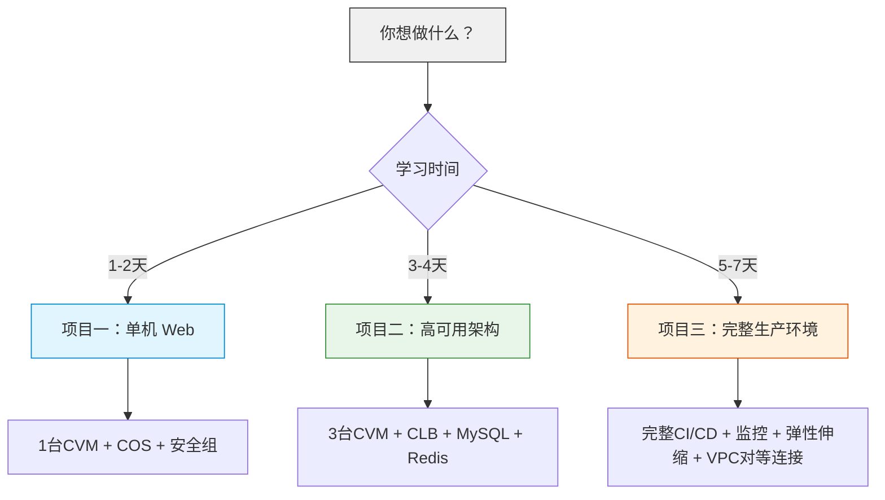

# Phase 7：项目实战

> 预计用时：持续（建议 1~2 周完成全部项目）
> 目标：从 0 到 1 完成三个递进项目，覆盖真实生产场景

---

## 项目一：单机 Web 应用部署 ⭐

> **难度**：入门 | **预计**：1~2 天 | **前置要求**：完成 Phase 1~2
>
> 💵 **费用估算**：1 台 S5.LARGE8 CVM + COS ≈ **0.5 元/小时**，建议 2 天内完成，总成本约 **10~20 元**。
> 完成后请立即 `terraform destroy`。

### 项目简介

部署一个简单的 Web 应用，这是你第一个完整的 Terraform 项目。目标是**能用、能跑、能验证**。

### 架构图

```
Internet
     │
     ▼
┌───────────────┐
│  CVM 实例      │
│  Nginx 欢迎页  │
│  公网 IP:80    │
└───────┬───────┘
        │
┌───────▼───────┐
│ COS Bucket    │
│ 静态资源       │
└───────────────┘
```

### 需求

- 1 个 VPC + 1 个子网
- 1 台 CVM（4C4G，CentOS / TencentOS）
- 1 个安全组（开放 80/443/22）
- 1 个 COS Bucket（存放静态资源）
- 通过 `user_data` 安装 Nginx 并部署静态页面

### 要求

- 使用变量和输出
- 使用 Data Source 查询镜像
- 使用 `terraform.tfvars` 管理配置
- 配置远程 State（COS 后端）

### 完整代码

**创建项目目录：**

```bash
mkdir project-one-single-web && cd project-one-single-web
```

**versions.tf：**

```hcl
terraform {
  required_version = ">= 1.6"
  required_providers {
    tencentcloud = {
      source  = "tencentcloudstack/tencentcloud"
      version = ">= 1.81.0"
    }
  }
  backend "cos" {
    # 注意：bucket 需要提前在 COS 控制台创建
    bucket = "my-terraform-state"    # 替换为你的 Bucket 名称
    region = "ap-guangzhou"
    prefix = "project-one"
    key    = "terraform.tfstate"
  }
}

provider "tencentcloud" {
  region = var.region
}
```

**main.tf：**

```hcl
# 查询镜像
data "tencentcloud_images" "default" {
  image_type = ["PUBLIC_IMAGE"]
  os_name    = "TencentOS Server 3.2"
}

# VPC
resource "tencentcloud_vpc" "main" {
  name       = var.vpc_name
  cidr_block = "10.0.0.0/16"
}

# 子网
resource "tencentcloud_subnet" "main" {
  name              = var.subnet_name
  vpc_id            = tencentcloud_vpc.main.id
  cidr_block        = "10.0.1.0/24"
  availability_zone = var.availability_zone
}

# 安全组
resource "tencentcloud_security_group" "web" {
  name        = "web-sg"
  description = "Web server security group"
}

resource "tencentcloud_security_group_rule" "http" {
  security_group_id = tencentcloud_security_group.web.id
  type              = "ingress"
  cidr_ip           = "0.0.0.0/0"
  ip_protocol       = "tcp"
  port_range        = "80,443"
  policy            = "accept"
}

resource "tencentcloud_security_group_rule" "ssh" {
  count = var.admin_ip != null ? 1 : 0

  security_group_id = tencentcloud_security_group.web.id
  type              = "ingress"
  cidr_ip           = var.admin_ip  # 限制为你的管理 IP
  ip_protocol       = "tcp"
  port_range        = "22"
  policy            = "accept"
}

# SSH 密钥对（用于 CVM 登录，替代密码）
resource "tencentcloud_key_pair" "main" {
  key_name   = "demo-key"
  public_key = file(var.public_key_path)
}

# CVM 实例
resource "tencentcloud_cvm_instance" "web" {
  instance_name     = var.instance_name
  availability_zone = var.availability_zone
  image_id          = data.tencentcloud_images.default.images[0].image_id
  instance_type     = var.instance_type

  system_disk_type = "CLOUD_SSD"
  system_disk_size = 50

  vpc_id    = tencentcloud_vpc.main.id
  subnet_id = tencentcloud_subnet.main.id

  security_groups = [tencentcloud_security_group.web.id]

  internet_max_bandwidth_out = 10
  allocate_public_ip         = true

  key_ids = [tencentcloud_key_pair.main.id]

  user_data = <<-EOF
    #!/bin/bash
    yum install -y nginx
    systemctl enable nginx
    systemctl start nginx
    echo "<h1>Welcome to Terraform + Tencent Cloud</h1>" > /usr/share/nginx/html/index.html
  EOF

  tags = {
    Name        = var.instance_name
    Environment = "dev"
    ManagedBy   = "terraform"
  }
}

# COS Bucket
resource "tencentcloud_cos_bucket" "static" {
  bucket = "static-${var.instance_name}-${var.app_id}"
  acl    = "private"

  tags = {
    Name        = "static-bucket"
    Environment = "dev"
  }
}
```

**variables.tf：**

```hcl
variable "region" {
  description = "腾讯云区域"
  type        = string
  default     = "ap-guangzhou"
}

variable "vpc_name" {
  description = "VPC 名称"
  type        = string
  default     = "project1-vpc"
}

variable "subnet_name" {
  description = "子网名称"
  type        = string
  default     = "project1-subnet"
}

variable "availability_zone" {
  description = "可用区"
  type        = string
  default     = "ap-guangzhou-3"
}

variable "instance_name" {
  description = "CVM 实例名称"
  type        = string
  default     = "web-server-01"
}

variable "instance_type" {
  description = "CVM 实例类型"
  type        = string
  default     = "S5.LARGE8"
}

variable "public_key_path" {
  description = "SSH 公钥文件路径（用于 CVM 密钥对登录）"
  type        = string
  default     = "~/.ssh/id_rsa.pub"
}

variable "admin_ip" {
  description = "管理 IP（用于 SSH 访问，如不设置则不创建 SSH 规则）"
  type        = string
  default     = null  # 建议设置为你的公网 IP，如 "123.123.123.123/32"
}

variable "app_id" {
  description = "应用 ID（用于 Bucket 唯一命名）"
  type        = string
}
```

**outputs.tf：**

```hcl
output "public_ip" {
  description = "CVM 公网 IP"
  value       = tencentcloud_cvm_instance.web.public_ip
}

output "vpc_id" {
  description = "VPC ID"
  value       = tencentcloud_vpc.main.id
}

output "bucket_name" {
  description = "COS Bucket 名称"
  value       = tencentcloud_cos_bucket.static.bucket
}

output "access_url" {
  description = "Web 访问地址"
  value       = "http://${tencentcloud_cvm_instance.web.public_ip}"
}
```

**terraform.tfvars：**

```hcl
region              = "ap-guangzhou"
availability_zone   = "ap-guangzhou-3"
instance_name       = "web-server-01"
instance_type       = "S5.LARGE8"
app_id              = "12345"
```

### 部署步骤

```bash
# 1. 设置腾讯云认证（环境变量）
$env:TENCENTCLOUD_SECRET_ID = "your_secret_id"
$env:TENCENTCLOUD_SECRET_KEY = "your_secret_key"

# 2. 初始化（确保 COS Bucket 已提前创建）
terraform init

# 3. 预览
terraform plan

# 4. 部署
terraform apply

# 5. 查看输出
terraform output

# 6. 验证
# 浏览器访问 http://<public_ip> 应该能看到 Nginx 欢迎页
```

### 验证

```bash
# 验证 Web 服务
curl http://$(terraform output -raw public_ip)

# 验证 SSH 连接
ssh root@$(terraform output -raw public_ip)

# 验证 COS Bucket
terraform state show tencentcloud_cos_bucket.static
```

### 清理

```bash
terraform destroy
```

---

## 项目二：高可用 Web 架构 ⭐⭐

> **难度**：中级 | **预计**：3~4 天 | **前置要求**：完成 Phase 3~4
>
> 💵 **费用估算**：3 台 CVM + CLB + MySQL + Redis + COS ≈ **5~8 元/小时**，建议 3~4 天内完成，总成本约 **50~100 元**。
> 每天结束时执行 `terraform destroy`，第二天重新 `apply`，可以大幅降低成本！

### 架构图

```
用户 → DNS → CLB(HTTPS) → [CVM-01, CVM-02, CVM-03]
                                 │
                ┌────────────────┼────────────────┐
                │                │                │
           MySQL主库        MySQL只读        Redis缓存
            (内网)           (内网)           (内网)
```

### 需求

- **网络层**：VPC + 公网/内网子网各 2 个（跨可用区）
- **负载均衡**：CLB（HTTPS:443 → HTTP:80）
- **计算层**：3 台 CVM（跨可用区部署）
- **数据库**：MySQL 主从 + Redis 缓存
- **存储**：COS 存储静态资源 + CBS 数据盘
- **安全**：安全组引用规则（Web→MySQL:3306, Web→Redis:6379）

### 要求

- 使用 Module 封装（VPC、CVM、MySQL、CLB、Security Group）
- 使用 Workspace 或目录隔离实现 dev/prod 环境
- 配置 CI/CD（GitHub Actions）
- 所有密码通过环境变量传入

### 项目结构

```bash
project-two-ha-web/
├── environments/
│   ├── dev/
│   │   ├── main.tf           # 调用模块
│   │   ├── backend.tf        # COS 后端
│   │   ├── provider.tf       # Provider 配置
│   │   ├── variables.tf
│   │   ├── terraform.tfvars  # 不入 Git
│   │   └── outputs.tf
│   └── prod/
│       ├── main.tf
│       ├── backend.tf
│       ├── ...
│       └── outputs.tf
├── modules/
│   ├── vpc/
│   ├── security_group/
│   ├── cvm/
│   ├── clb/
│   ├── mysql/
│   └── redis/
├── scripts/
│   └── init.sh
└── .github/
    └── workflows/
        └── terraform.yml
```

### 实现步骤

**Step 1：创建 VPC 模块**

参考 Phase 4.1 的 VPC 模块代码，支持多可用区、多子网。

**Step 2：创建安全组模块**

```hcl
# modules/security_group/main.tf
resource "tencentcloud_security_group" "web" {
  name        = "${var.project}-${var.environment}-web-sg"
  description = "Web server security group"
  tags        = var.tags
}

resource "tencentcloud_security_group" "mysql" {
  name        = "${var.project}-${var.environment}-mysql-sg"
  description = "MySQL security group"
  tags        = var.tags
}

resource "tencentcloud_security_group" "redis" {
  name        = "${var.project}-${var.environment}-redis-sg"
  description = "Redis security group"
  tags        = var.tags
}

# Web 安全组规则（开放 80、443、22）
resource "tencentcloud_security_group_rule" "web_http" {
  security_group_id = tencentcloud_security_group.web.id
  type              = "ingress"
  cidr_ip           = "0.0.0.0/0"
  ip_protocol       = "tcp"
  port_range        = "80,443"
  policy            = "accept"
}

resource "tencentcloud_security_group_rule" "web_ssh" {
  security_group_id = tencentcloud_security_group.web.id
  type              = "ingress"
  cidr_ip           = var.admin_ip
  ip_protocol       = "tcp"
  port_range        = "22"
  policy            = "accept"
}

# MySQL 安全组规则（引用 Web 安全组）
resource "tencentcloud_security_group_rule" "mysql_in" {
  security_group_id        = tencentcloud_security_group.mysql.id
  type                     = "ingress"
  ip_protocol              = "tcp"
  port_range               = "3306"
  policy                   = "accept"
  source_security_group_id = tencentcloud_security_group.web.id
}

# Redis 安全组规则（引用 Web 安全组）
resource "tencentcloud_security_group_rule" "redis_in" {
  security_group_id        = tencentcloud_security_group.redis.id
  type                     = "ingress"
  ip_protocol              = "tcp"
  port_range               = "6379"
  policy                   = "accept"
  source_security_group_id = tencentcloud_security_group.web.id
}
```

# --- 需要在 modules/security_group/variables.tf 中定义以下变量 ---
# variable "project" {
#   description = "项目名称"
#   type        = string
# }
# variable "environment" {
#   description = "环境名称"
#   type        = string
# }
# variable "admin_ip" {
#   description = "管理 IP 地址段（用于 SSH 访问限制）"
#   type        = string
# }
# variable "tags" {
#   description = "资源标签"
#   type        = map(string)
#   default     = {}
# }

**Step 3：创建 CVM 模块**

```hcl
# modules/cvm/main.tf
resource "tencentcloud_cvm_instance" "web" {
  count = var.instance_count

  instance_name     = "${var.instance_name}-${count.index + 1}"
  availability_zone = var.availability_zones[count.index % length(var.availability_zones)]
  image_id          = var.image_id
  instance_type     = var.instance_type

  system_disk_type = "CLOUD_SSD"
  system_disk_size = 50

  vpc_id    = var.vpc_id
  subnet_id = var.subnet_ids[count.index % length(var.subnet_ids)]

  security_groups = var.security_group_ids

  internet_max_bandwidth_out = 10
  allocate_public_ip         = false  # 通过 CLB 暴露，不需要公网 IP

  key_ids = var.key_ids

  user_data = var.user_data

  tags = var.tags
}
```

# --- 需要在 modules/cvm/variables.tf 中定义以下变量 ---
# variable "instance_count" {
#   description = "CVM 实例数量"
#   type        = number
# }
# variable "instance_name" {
#   description = "CVM 实例名称前缀"
#   type        = string
# }
# variable "availability_zones" {
#   description = "可用区列表"
#   type        = list(string)
# }
# variable "image_id" {
#   description = "镜像 ID"
#   type        = string
# }
# variable "instance_type" {
#   description = "实例类型"
#   type        = string
# }
# variable "vpc_id" {
#   description = "VPC ID"
#   type        = string
# }
# variable "subnet_ids" {
#   description = "子网 ID 列表"
#   type        = list(string)
# }
# variable "security_group_ids" {
#   description = "安全组 ID 列表"
#   type        = list(string)
# }
# variable "key_ids" {
#   description = "密钥对 ID 列表"
#   type        = list(string)
#   default     = []
# }
# variable "user_data" {
#   description = "自定义数据（初始化脚本）"
#   type        = string
#   default     = ""
# }
# variable "tags" {
#   description = "资源标签"
#   type        = map(string)
#   default     = {}
# }

**Step 4：创建 CLB 模块**

```hcl
# modules/clb/main.tf
resource "tencentcloud_clb_instance" "main" {
  clb_name             = "${var.clb_name}-clb"
  network_type         = "OPEN"
  vpc_id               = var.vpc_id
  subnet_id            = var.subnet_id
  internet_charge_type = "TRAFFIC_POSTPAID_BY_HOUR"
  tags                 = var.tags
}

resource "tencentcloud_clb_listener" "http" {
  clb_id        = tencentcloud_clb_instance.main.id
  listener_name = "http"
  port          = 80
  protocol      = "HTTP"
}

resource "tencentcloud_clb_listener_rule" "web" {
  clb_id              = tencentcloud_clb_instance.main.id
  listener_id         = tencentcloud_clb_listener.http.listener_id
  domain              = var.domain
  url                 = "/"
  health_check_switch = true
  health_check_http_code = 200
}

resource "tencentcloud_clb_attachment" "web" {
  clb_id      = tencentcloud_clb_instance.main.id
  listener_id = tencentcloud_clb_listener.http.listener_id
  rule_id     = tencentcloud_clb_listener_rule.web.rule_id

  dynamic "targets" {
    for_each = var.instance_ids
    content {
      instance_id = targets.value
      port        = 80
      weight      = 10
    }
  }
}
```

# --- 需要在 modules/clb/variables.tf 中定义以下变量 ---
# variable "clb_name" {
#   description = "CLB 名称前缀"
#   type        = string
# }
# variable "vpc_id" {
#   description = "VPC ID"
#   type        = string
# }
# variable "subnet_id" {
#   description = "子网 ID"
#   type        = string
# }
# variable "instance_ids" {
#   description = "后端 CVM 实例 ID 列表"
#   type        = list(string)
# }
# variable "domain" {
#   description = "监听器转发域名"
#   type        = string
#   default     = "default.example.com"
# }
# variable "tags" {
#   description = "资源标签"
#   type        = map(string)
#   default     = {}
# }

**Step 5：创建 environments/dev/main.tf**

```hcl
module "vpc" {
  source = "../../modules/vpc"

  vpc_name            = "myapp-dev"
  vpc_cidr            = "10.0.0.0/16"
  public_subnet_cidrs  = ["10.0.1.0/24", "10.0.3.0/24"]
  private_subnet_cidrs = ["10.0.2.0/24", "10.0.4.0/24"]
  availability_zones   = ["ap-guangzhou-3", "ap-guangzhou-4"]
  tags = {
    Environment = "dev"
  }
}

module "sg" {
  source = "../../modules/security_group"

  project     = "myapp"
  environment = "dev"
  admin_ip    = var.admin_ip
  tags = {
    Environment = "dev"
  }
}

module "cvm" {
  source = "../../modules/cvm"

  instance_name      = "myapp-dev-web"
  instance_count     = 2
  instance_type      = "S5.LARGE8"
  image_id           = data.tencentcloud_images.default.images[0].image_id
  vpc_id             = module.vpc.vpc_id
  subnet_ids         = module.vpc.public_subnet_ids
  availability_zones = ["ap-guangzhou-3", "ap-guangzhou-4"]
  security_group_ids = [module.sg.web_sg_id]
  key_ids            = [tencentcloud_key_pair.main.id]
  tags = {
    Environment = "dev"
  }
}

module "clb" {
  source = "../../modules/clb"

  clb_name     = "myapp-dev"
  vpc_id       = module.vpc.vpc_id
  subnet_id    = module.vpc.public_subnet_ids[0]
  instance_ids = module.cvm.instance_ids
  domain       = "dev.example.com"
  tags = {
    Environment = "dev"
  }
}

module "mysql" {
  source = "../../modules/mysql"

  instance_name     = "myapp-dev-mysql"
  mem_size          = 4000
  volume_size       = 100
  vpc_id            = module.vpc.vpc_id
  subnet_id         = module.vpc.private_subnet_ids[0]
  availability_zone = "ap-guangzhou-3"
  security_group_id = module.sg.mysql_sg_id
  db_password       = var.db_password
  tags = {
    Environment = "dev"
  }
}

module "redis" {
  source = "../../modules/redis"

  instance_name     = "myapp-dev-redis"
  mem_size          = 2048
  vpc_id            = module.vpc.vpc_id
  subnet_id         = module.vpc.private_subnet_ids[0]
  availability_zone = "ap-guangzhou-3"
  security_group_id = module.sg.redis_sg_id
  redis_password    = var.redis_password
  tags = {
    Environment = "dev"
  }
}
```

# --- 需要在 environments/dev/variables.tf 中定义以下变量 ---
# variable "admin_ip" {
#   description = "管理 IP 地址段（用于 SSH 访问限制）"
#   type        = string
#   default     = "0.0.0.0/0"
# }
# variable "db_password" {
#   description = "MySQL 数据库密码"
#   type        = string
#   sensitive   = true
# }
# variable "redis_password" {
#   description = "Redis 缓存密码"
#   type        = string
#   sensitive   = true
# }
# 注意：data.tencentcloud_images.default 和 tencentcloud_key_pair.main 也需要在
# environments/dev/main.tf 或单独的 data.tf / key.tf 中定义

### 验证

```bash
# 1. 能通过 CLB 域名访问应用
curl http://<clb_vip>

# 2. MySQL 从库能同步主库数据
# 在主库创建数据，在从库验证

# 3. Redis 能正常读写
redis-cli -h <redis_ip> -p 6379 -a <password> ping

# 4. 缩容一台 CVM 不影响服务
# 通过 CLB 持续访问，同时修改 desired_size 减少一台
```

---

## 项目三：完整生产环境（含 VPC 对等连接）⭐⭐⭐

> **难度**：高级 | **预计**：5~7 天 | **前置要求**：完成 Phase 5~6
>
> 💵 **费用估算**：完整生产环境约 **10~15 元/小时**，建议 5~7 天内完成，总成本约 **200~500 元**。
> 强烈建议每天结束时 `destroy`，仅在需要验证时 `apply`。

### 架构

```
                         ┌─────────────────┐
                         │  GitLab         │
                         │ (代码仓库)       │
                         └────────┬────────┘
                                  │CI/CD
                         ┌────────▼────────┐
                         │ CI/CD Runner    │
                         └────────┬────────┘
                                  │
         ┌────────────────────────┼────────────────────────┐
         │                        │                        │
         │         ┌──────────────▼──────────────┐         │
         │         │        CLB 负载均衡层        │         │
         │         │ (HTTPS:443 / HTTP:80 / WS)  │         │
         │         └──────────────┬──────────────┘         │
         │                        │                        │
         │         ┌──────────────▼──────────────┐         │
         │         │    Web 计算层 (Auto Scaling) │         │
         │         │ [CVM-01] [CVM-02] [CVM-03]  │         │
         │         │ 启动配置 + 伸缩策略 + 健康检查 │         │
         │         └──────────────┬──────────────┘         │
         │                        │                        │
         │         ┌──────────────▼──────────────┐         │
         │         │       数据层 (内网)           │         │
         │         │  ┌──────┐ ┌──────┐ ┌──────┐  │         │
         │         │  │MySQL │ │Redis │ │CKafka│  │         │
         │         │  │主从   │ │集群   │ │消息   │  │         │
         │         │  └──────┘ └──────┘ └──────┘  │         │
         │         └──────────────┬──────────────┘         │
         │                        │                        │
         │         ┌──────────────▼──────────────┐         │
         │         │        存储层                │         │
         │         │ COS(静态/日志/备份) + CBS    │         │
         │         └─────────────────────────────┘         │
         │                        │                        │
         │         ┌──────────────▼──────────────┐         │
         │         │   VPC 对等连接               │         │
         │         │   prod VPC ←→ test VPC      │         │
         │         └─────────────────────────────┘         │
```

### 需求

- **完整网络**：VPC + 多可用区子网 + NAT 网关 + 对等连接
- **弹性伸缩**：Auto Scaling Group + 启动配置 + 伸缩策略
- **高可用数据库**：MySQL 主从跨可用区 + Redis 集群
- **消息队列**：CKafka（可选）
- **存储**：COS（生命周期管理）+ CBS（快照策略）
- **监控告警**：云监控指标 + 告警策略
- **CI/CD**：GitLab CI 完整流水线（Plan → 审批 → Apply）
- **日志**：日志服务 CLS 采集
- **DNS**：DNSPod 解析

### VPC 对等连接

如果业务需要多环境网络隔离（如生产 VPC 与测试 VPC 隔离），可以通过 VPC 对等连接实现互通。以下示例假设已创建 `tencentcloud_route_table.prod` 和 `tencentcloud_route_table.test`：

```hcl
# 查询当前账号信息（用于对等连接的 destination_uin）
data "tencentcloud_user_info" "current" {}

# 生产环境 VPC
resource "tencentcloud_vpc" "prod" {
  name       = "prod-vpc"
  cidr_block = "10.0.0.0/16"  # 注意：对等连接的 VPC 不能有 CIDR 重叠
}

# 测试环境 VPC
resource "tencentcloud_vpc" "test" {
  name       = "test-vpc"
  cidr_block = "10.1.0.0/16"
}

# 创建对等连接
resource "tencentcloud_vpc_peer_connect_manager" "prod_to_test" {
  source_vpc_id           = tencentcloud_vpc.prod.id
  destination_vpc_id      = tencentcloud_vpc.test.id
  destination_region      = "ap-guangzhou"  # 同地域对等连接
  destination_uin         = data.tencentcloud_user_info.current.uin
  peering_connection_name = "prod-to-test"
  bandwidth               = 100  # Mbps，同地域可选
}

# 接受对等连接
resource "tencentcloud_vpc_peer_connect_accept_operation" "accept" {
  peering_connection_id = tencentcloud_vpc_peer_connect_manager.prod_to_test.id
}

# 生产路由表添加通往测试 VPC 的路由
resource "tencentcloud_route_table_entry" "prod_to_test" {
  route_table_id         = tencentcloud_route_table.prod.id
  destination_cidr_block = "10.1.0.0/16"  # 测试 VPC 的 CIDR
  next_type              = "PEERCONNECTION"
  next_hub               = tencentcloud_vpc_peer_connect_manager.prod_to_test.peering_connection_id
}

# 测试路由表添加通往生产 VPC 的回程路由（双向互通）
resource "tencentcloud_route_table_entry" "test_to_prod" {
  route_table_id         = tencentcloud_route_table.test.id
  destination_cidr_block = "10.0.0.0/16"  # 生产 VPC 的 CIDR
  next_type              = "PEERCONNECTION"
  next_hub               = tencentcloud_vpc_peer_connect_manager.prod_to_test.peering_connection_id
}
```

> 💡 **对等连接要点**：
> - 两个 VPC 的 CIDR 段**不能重叠**（否则路由无法区分流量应该去哪个 VPC）
> - 同地域对等连接**免费**（但带宽有限制），跨地域对等连接按流量计费
> - 路由表需要**关联到子网**才能生效，且需要**双向路由**才能互通
> - 同账号同地域对等连接会自动接受，但 Terraform 中仍须 `accept_operation` 资源完成状态变更

### 扩展要求

- 使用 Terragrunt 管理多环境（可选）
- 实施 Sentinel 或 OPA 策略（可选）
- 集成堡垒机（跳板机）访问
- 配置 WAF 和 CDN

### 实施步骤

**Step 1：创建 COS 后端 Bucket**

```bash
# 手动在 COS 控制台创建
# Bucket 名称：company-terraform-state
# 区域：ap-guangzhou
# 权限：私有读写
# 开启版本控制（用于 State 版本管理）
```

**Step 1b（可选）：多 VPC 隔离与对等连接**

参考上面 VPC 对等连接代码，创建生产 VPC 与测试 VPC 之间的互通。

**Step 2：创建 CI/CD 流水线**

参考 Phase 5.3 的 GitLab CI 配置，增加 Plan 输出到 PR 评论的功能。

**Step 3：部署基础网络层**

```bash
# 先部署 VPC、子网、路由表、NAT 网关
cd environments/prod
terraform init
terraform apply -target=module.vpc
```

**Step 4：部署安全组**

```bash
terraform apply -target=module.sg
```

**Step 5：部署数据层**

```bash
terraform apply -target=module.mysql -target=module.redis
```

**Step 6：部署计算层和负载均衡**

```bash
terraform apply
```

**Step 7：配置监控告警**

```hcl
# 云监控告警策略
resource "tencentcloud_monitor_alarm_policy" "cpu_high" {
  policy_name  = "prod-cpu-high"
  monitor_type = "MT_QCE"
  namespace    = "cvm"
  conditions {
    metric_name           = "cpu_usage"
    period                = 60
    statistic             = "AVERAGE"
    threshold             = 80
    comparison_operator   = "GREATER_THAN"
    continuous_period     = 3
  }
  event_conditions {
    event_name = "ping_unreachable"
  }

  policy_tag = [
    {
      key   = "Environment"
      value = "production"
    }
  ]
}
```

---

## 项目检查清单

```markdown
### 通用标准
- [ ] 所有资源有完整标签（Project/Environment/ManagedBy/Owner）
- [ ] 使用远程 State（COS 后端）
- [ ] 代码通过 terraform fmt 和 terraform validate
- [ ] 没有硬编码的敏感信息
- [ ] 有 README 说明如何部署
- [ ] terraform.tfvars 在 .gitignore 中
- [ ] 变量都有 description 和 type

### 生产标准
- [ ] 跨可用区部署（至少 2 个可用区）
- [ ] 数据库有备份策略（自动备份或快照）
- [ ] 安全组最小权限原则（SSH 限制 IP，数据库只允许 Web 安全组）
- [ ] 有监控和告警（CPU、内存、磁盘）
- [ ] 有弹性伸缩（至少预留配置）
- [ ] CI/CD 流水线完整（Plan → 审批 → Apply）
- [ ] 有灾难恢复计划（State 备份、资源导入方案）
- [ ] 命名规范统一（project-env-role-序号）

### 项目一验证
- [ ] terraform init 成功
- [ ] terraform plan 没有错误
- [ ] terraform apply 成功创建所有资源
- [ ] 浏览器访问公网 IP 能看到 Nginx 欢迎页
- [ ] terraform destroy 成功清理所有资源

### 项目二验证
- [ ] 所有模块能独立运行
- [ ] 跨可用区部署成功
- [ ] CLB 健康检查通过
- [ ] MySQL 主从同步正常
- [ ] Redis 连接正常
- [ ] 缩容一台 CVM 不影响服务
- [ ] CI/CD 流水线运行正常

### 项目三验证
- [ ] 弹性伸缩组自动扩缩容
- [ ] 监控告警策略生效
- [ ] 日志服务正常采集
- [ ] DNS 解析正常
- [ ] VPC 对等连接双向互通
- [ ] 灾难恢复流程可行
```

---

## 推荐学习路径时间表

```
第 1 周 → Phase 1 基础入门 + Phase 2 腾讯云入门          → 目标：能创建单个 CVM 实例
         → 完成项目一
第 2 周 → Phase 3 核心资源实战
         → 目标：能搭建完整网络 + 数据库 + 存储
第 3 周 → Phase 4 进阶技巧
         → 目标：模块化 + 远程 State + 多环境
第 4 周 → Phase 5 生产环境实践 + Phase 6 运维
         → 目标：生产级项目模板 + CI/CD
         → 开始项目二
第 5 周 → 项目实战
         → 目标：完成项目二
第 6 周 → 项目三 + 持续学习
         → 目标：完成项目三
第 7 周 → 持续学习
         → - Terragrunt（多环境管理工具）
         → - 自定义 Provider 开发
         → - Crossplane / Pulumi 对比
         → - 腾讯云 TIC 产品
```

---

## 🎯 互动练习

### 项目选择指南



### 项目自检清单

**完成项目后，逐一确认：**

- [ ] 所有资源能正常创建（`terraform apply` 成功）
- [ ] 能通过公网 IP 或域名访问服务
- [ ] 数据库能正常读写
- [ ] `terraform destroy` 能清理所有资源
- [ ] 远程 State 已配置（COS 后端）
- [ ] 代码已提交到 Git 仓库
- [ ] 所有敏感信息通过环境变量传入

### 自测题

<details>
<summary>📑 第 1 题：为什么项目二（高可用架构）需要将 CVM 部署在不同可用区？</summary>

**答案**：跨可用区部署可以避免单点故障。如果一个可用区发生故障（如电力中断），其他可用区的 CVM 继续提供服务。CLB 会自动将流量分发到健康的实例中。
</details>

<details>
<summary>📑 第 2 题：项目一和项目二在架构设计上最大的区别是什么？</summary>

**答案**：项目一只有 1 台 CVM，存在单点故障风险。项目二引入了 CLB 负载均衡 + 多台 CVM + MySQL 主从 + Redis 缓存，实现了高可用架构——任何一台 CVM 宕机都不会影响服务。
</details>

<details>
<summary>📑 第 3 题：项目三中为什么要用 Auto Scaling 弹性伸缩组？</summary>

**答案**：弹性伸缩组可以根据负载自动增加或减少 CVM 实例数量。当 CPU 超过 70% 时自动扩容，低于 30% 时自动缩容，既保证性能又节省成本。同时 ASG 会自动替换不健康的实例，提高可用性。
</details>

---

## 推荐学习资源汇总

### 官方文档

- [Terraform 官方文档](https://developer.hashicorp.com/terraform/docs)
- [腾讯云 Terraform Provider](https://registry.terraform.io/providers/tencentcloudstack/tencentcloud/latest/docs)
- [腾讯云 IaC 产品](https://cloud.tencent.com/product/iac)

### 书籍

- 《Terraform Up & Running》第 3 版 — Yevgeniy Brikman
- 《基础设施即代码》— Kief Morris

### 在线课程

- [HashiCorp 官方教程](https://developer.hashicorp.com/terraform/tutorials)
- [Terraform 入门教程 (中文)](https://lonegunmanb.github.io/introduction-terraform)
- Udemy: Terraform for Tencent Cloud

### 社区与博客

- [腾讯云开发者社区 — Terraform 专栏](https://cloud.tencent.com/developer/article?keyword=Terraform)
- [Terraform 最佳实践 (英文)](https://www.terraform-best-practices.com/)

---

## 🎉 恭喜完成全部学习路线！

你现在已经具备使用 Terraform 在腾讯云上部署生产环境的能力。记住：

1. **安全第一** — 密钥管理、最小权限、安全组
2. **State 是核心** — 远程 State、锁定、备份
3. **模块化** — 复用、版本管理、团队协作
4. **自动化** — CI/CD 集成、Policy as Code
5. **持续学习** — 云服务不断更新，保持学习

### 下一步学习方向

1. **Terragrunt**：管理多环境 Terraform 配置的工具，减少重复代码
2. **自定义 Provider 开发**：用 Go 编写自己的 Terraform Provider
3. **Crossplane**：Kubernetes 原生的基础设施编排
4. **Pulumi**：用通用编程语言（TypeScript/Go/Python）管理基础设施
5. **腾讯云 TIC**：腾讯云原生的 Terraform 管理平台
6. **OPA / Sentinel**：策略即代码（Policy as Code）

**祝你在腾讯云的生产环境中一切顺利！** 🚀