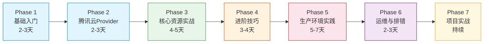

# Terraform × Tencent Cloud — 从零到生产环境 🚀

<p align="center">
  
  
  
  
</p>

<p align="center">
  <b>中文 | <a href="#en">English</a></b>
</p>

---

一份完整的、从零基础到生产环境的 **Terraform × 腾讯云** 学习教程。含 7 个渐进式 Phase、3 个实战项目、自测题和动手练习。

## 📑 目录

- [为什么有这个教程](#-为什么有这个教程)
- [适合谁](#-适合谁)
- [学习路线](#-学习路线)
- [快速开始](#-快速开始)
- [文件结构](#-文件结构)
- [互动学习](#-互动学习)
- [技术审核](#-技术审核)
- [贡献指南](#-贡献指南)
- [许可证](#-许可证)

---

## 🎆 为什么有这个教程？

Terraform 是基础设施即代码（IaC）的事实标准，但现有的中文教程要么：

- ❌ 只讲通用概念，不涉及腾讯云具体资源
- ❌ 是官方文档翻译，不是循序渐进的教法
- ❌ 缺乏生产环境的最佳实践和运维经验
- ❌ 没有代码审核，代码跑不通

**这个教程的目标是**：让你学完就能在腾讯云上部署生产级环境。

## 👐 适合谁？

| 背景 | 是否适合 |
|------|---------|
| 有基本云计算概念，Terraform 零基础 | ✅ **非常适合** |
| 用过 AWS/Azure 的 Terraform，想转腾讯云 | ✅ 直接跳到 Phase 2 |
| 完全不懂云计算的纯小白 | ⚠️ 建议先学基础网络知识 |
| 资深 Terraform 用户 | 💡 可作为腾讯云参考手册 |

## 🗺️ 学习路线



| Phase | 内容 | 目标 | 预计时间 |
|-------|------|------|---------|
| **1** | 基础入门 | IaC 概念、HCL 语法、核心命令、State 理解 | 2-3 天 |
| **2** | 腾讯云 Provider 入门 | 认证配置、第一个 CVM、变量与输出 | 2-3 天 |
| **3** | 核心资源实战 | VPC、CVM、MySQL、Redis、COS、CLB、安全组 | 4-5 天 |
| **4** | 进阶技巧 | Module、远程 State、Workspace、动态资源 | 3-4 天 |
| **5** | 生产环境实践 | 目录结构、Secret 管理、CI/CD、迁移策略 | 5-7 天 |
| **6** | 运维与排错 | 常见错误、State 操作、import、Drift 修复 | 2-3 天 |
| **7** | 项目实战 | 3 个递进项目（单机→高可用→完整生产环境） | 持续 |

## 🚀 快速开始

```bash
# 1. 安装 Terraform
# Windows: choco install terraform
# macOS: brew install terraform
# Linux: 参考官方文档

# 2. 验证安装
terraform version

# 3. 从 Phase 1 开始
# 不需要腾讯云账号！用 local_file Provider 就能跑通
```

## 📁 文件结构

```
terraform-tencentcloud-production-guide/
├── README.md                          # 本文档
├── LICENSE
├── .gitignore
├── 01-基础入门.md                     # Phase 1: IaC 概念、HCL 语法、Hello World
├── 02-腾讯云Provider入门.md            # Phase 2: 认证、第一个 CVM、变量输出
├── 03-核心资源实战.md                  # Phase 3: VPC、CVM、MySQL、Redis、COS、CLB
├── 04-进阶技巧.md                      # Phase 4: Module、远程 State、Workspace
├── 05-生产环境实践.md                  # Phase 5: 目录结构、CI/CD、Secret 管理
├── 06-运维与排错.md                    # Phase 6: 错误排查、State 操作、Drift 修复
├── 07-项目实战.md                      # Phase 7: 三个递进项目
├── 审核报告.md                         # 技术审核报告（含 6 个严重错误修复记录）
├── 交叉验证报告.md                      # 与官方文档和社区教程的交叉验证
└── 教学质量审核报告.md                   # 教学法审核报告
```

## 🎃 互动学习

每个章节都包含互动元素，点击即可展开答案：

<details>
<summary>📑 示例：Terraform 是声明式还是命令式工具？</summary>

**答案：声明式**。你描述"想要什么"，Terraform 决定"怎么干"。
</details>

| 互动类型 | 说明 |
|---------|------|
| ✅ **自测题** | 每个 Phase 3-4 道选择题/简答题 |
| 👐 **动手练习** | 跟着做的实操任务 |
| 💡 **思考题** | 启发深度思考的问题 |
| 🗓️ **决策流程图** | Mermaid 可视化的架构选择指南 |

## 🏛️ 技术审核

本教程经过 **3 轮独立审核**：

| 审核轮次 | 审核人 | 发现问题 | 状态 |
|---------|-------|---------|------|
| 第 1 轮 | 🏛️ 技术审核（资深 Terraform 专家） | 6 个严重错误 + 4 个警告 | ✅ 全部修复 |
| 第 2 轮 | 🎗️ 学生视角（零基础模拟） | 3 个核心建议 | ✅ 全部采纳 |
| 第 3 轮 | 👨‍🏫 教学法审核（10 年讲师） | 6 个遗留问题 | ✅ 全部修复 |

此外，还与 **12 个网络资源**（官方文档、社区博客、GitHub 模块）进行了交叉验证。

## 🛠️ 贡献指南

欢迎贡献！你可以通过以下方式参与：

- **提交 Issue**：发现错误、内容过时或有改进建议
- **提交 Pull Request**：修复错误、补充内容、优化结构
- **分享反馈**：学完后告诉我们你的学习体验

### 本地预览

```bash
# 所有文件是标准 Markdown，直接用编辑器或 GitHub 预览
# 推荐使用 Typora 或 VS Code + Markdown Preview
```

## 📋 许可证

本项目采用 MIT 许可证。详见 [LICENSE](LICENSE) 文件。

---

## EN

<p id="en"></p>

# Terraform × Tencent Cloud — From Zero to Production 🚀

A complete Chinese-language tutorial for learning Terraform with Tencent Cloud, from absolute beginner to production deployment. Includes 7 progressive phases, 3 hands-on projects, self-tests, and exercises.

**Note**: This tutorial is primarily written in Chinese (中文).

### Quick Links

- [Phase 1: Fundamentals](01-基础入门.md)
- [Phase 2: Tencent Cloud Provider](02-腾讯云Provider入门.md)
- [Phase 3: Core Resources](03-核心资源实战.md)
- [Phase 4: Advanced Techniques](04-进阶技巧.md)
- [Phase 5: Production Practices](05-生产环境实践.md)
- [Phase 6: Operations & Troubleshooting](06-运维与排错.md)
- [Phase 7: Projects](07-项目实战.md)